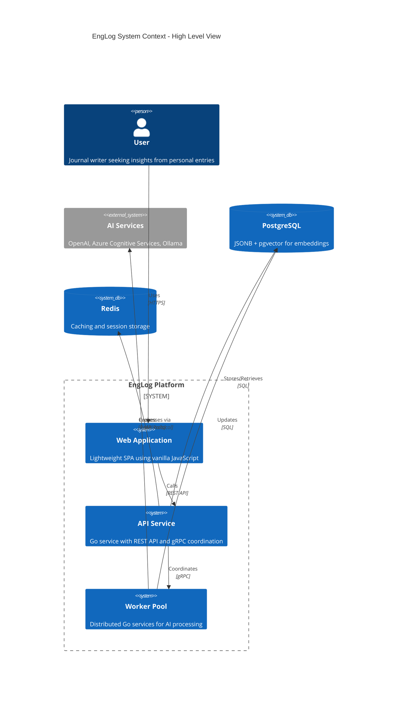
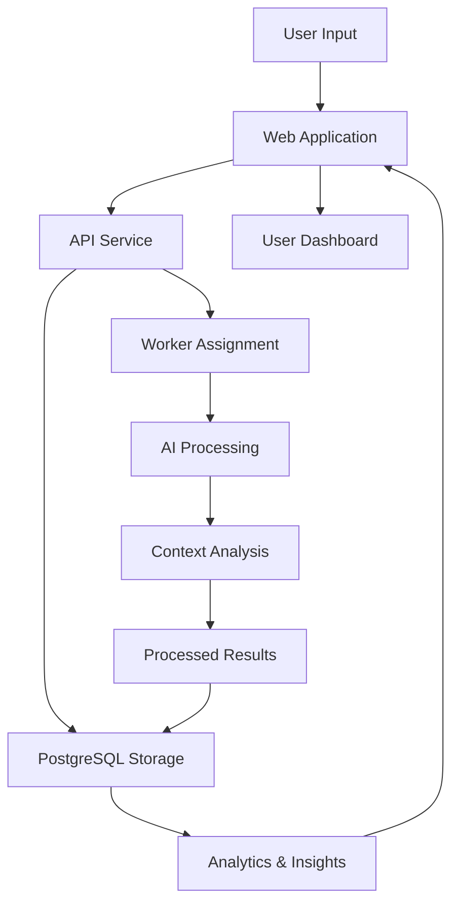

# EngLog System Overview

**Version:** 1.0
**Date:** August 4, 2025
**Author:** Senior Staff Software Architect, Garnizeh
**Status:** Complete

---

## 🎯 Executive Summary

EngLog is an innovative personal journal management system that leverages artificial intelligence to transform how users collect, process, and analyze their personal reflections and experiences. The platform empowers users to gain deeper insights into their thoughts, emotions, and personal growth patterns through intelligent data processing and analysis.

## 🏢 Business Objectives

### Primary Goals

- **Personal Insight Generation:** Enable users to discover patterns, trends, and insights from their journal entries through AI-powered analysis
- **Collaborative Analytics:** Support group-based journaling for teams, projects, and communities with collective insights
- **Emotional Intelligence:** Provide sentiment analysis and emotional tracking to help users understand their emotional patterns
- **Team Dynamics:** Analyze group dynamics, collaboration patterns, and collective emotional health
- **Secure Data Management:** Ensure user journal data is stored securely and privately with enterprise-grade security measures
- **Scalable Platform:** Build a system capable of handling thousands of concurrent users with sub-second response times
- **Extensible Architecture:** Design a modular system that can accommodate future AI capabilities and integrations

### Success Metrics

- **User Engagement:** Monthly active users and journal entry frequency
- **AI Processing Quality:** Accuracy and relevance of generated insights
- **System Performance:** Response times under 500ms for core operations
- **Data Security:** Zero data breaches and full compliance with privacy regulations
- **Scalability:** Support for 10,000+ concurrent users with automatic scaling

## 🎯 Target Use Cases

### Personal Use Cases

- **Individual Reflection:** Personal journaling with AI-powered insights and pattern recognition
- **Mood Tracking:** Emotional pattern analysis with historical trend visualization
- **Goal Tracking:** Personal goal management with progress analysis and milestone tracking

### Team and Collaborative Use Cases

- **Sprint Retrospectives:** Development teams using groups to track sprint progress, blockers, and team sentiment
- **Project Management:** Project groups for tracking milestones, team morale, and collective progress insights
- **Remote Team Building:** Distributed teams sharing experiences and analyzing collaboration patterns
- **Agile Ceremonies:** Daily standups, retrospectives, and planning sessions with sentiment and engagement tracking

### Organizational Use Cases

- **Employee Wellness:** HR teams monitoring team emotional health and work-life balance patterns
- **Research Projects:** Academic or research teams tracking project progress and collaborative insights
- **Creative Collaborations:** Creative teams analyzing inspiration patterns and collaborative dynamics
- **Training Programs:** Learning groups tracking progress, challenges, and collective skill development

### Mixed and Custom Use Cases

- **Life Coaching Groups:** Coaches and clients using mixed groups for progress tracking and insights
- **Therapy Support Groups:** Mental health professionals using groups for collective progress monitoring
- **Community Projects:** Non-profit organizations tracking community engagement and project impact
- **Family Journaling:** Families using groups to track shared experiences and relationship dynamics

## 🏗️ System Architecture Overview

### Core Components

### 1. API Service (Go)

- **Purpose:** Central coordination hub and client interface
- **Responsibilities:**
  - RESTful API for web client communication
  - User authentication and authorization
  - Journal data management and storage
  - Worker pool coordination via gRPC
  - Task assignment and status tracking
- **Technology:** Go 1.24+, Gin framework, gRPC server

### 2. Worker Pool (Go)

- **Purpose:** Distributed AI processing engine
- **Responsibilities:**
  - Register with API service via gRPC clients
  - Process journal entries through AI services
  - Generate insights, sentiment analysis, and embeddings
  - Store processed results in database
  - Report processing status to API service
- **Technology:** Go 1.24+, gRPC clients, AI service integrations

### 3. Web Application

- **Purpose:** User interface and experience
- **Responsibilities:**
  - Journal entry creation and management
  - Insights and analytics visualization
  - Group collaboration interface
  - User profile and settings management
- **Technology:** Vanilla JavaScript, CSS frameworks via CDN

## 💾 Data Architecture

### Data Flow Overview

### Core Data Types

1. **Journal Entries:** Flexible JSONB structure accepting any user data format
2. **Processed Content:** AI-generated insights, sentiment analysis, and embeddings
3. **User Context:** Relationship graphs, behavioral patterns, and temporal clustering
4. **Group Data:** Collaborative analytics and shared insights
5. **Tag System:** Hierarchical organization and AI-suggested categorization

## 🔒 Security & Privacy

### Security Principles

- **Zero-Trust Architecture:** All components verify identity and authorization
- **Data Encryption:** End-to-end encryption for data in transit and at rest
- **Privacy by Design:** User consent and granular privacy controls
- **Audit Logging:** Comprehensive access and modification tracking
- **Compliance:** GDPR, HIPAA, and SOC 2 compliance frameworks

### Authentication Strategy

- **Multi-Modal Auth:** OAuth 2.0 (Google, GitHub, Microsoft) + OTP email authentication
- **JWT Tokens:** Secure token-based authentication with refresh capabilities
- **Session Management:** Redis-based session storage with configurable expiration
- **Multi-Factor Authentication:** Optional MFA for enhanced security

## 🚀 Technology Stack

### Backend Technologies

- **Language:** Go 1.24+ for high-performance concurrent processing
- **API Framework:** Gin for RESTful API development
- **Database:** PostgreSQL with JSONB for flexible document storage
- **Vector Database:** pgvector extension for semantic search and embeddings
- **Cache:** Redis for high-performance caching and session storage
- **Communication:** gRPC for inter-service communication

### AI & Machine Learning

- **Primary AI Provider:** OpenAI GPT-4 for complex analysis and insight generation
- **Secondary Provider:** Azure Cognitive Services for sentiment and emotion analysis
- **Local Fallback:** Ollama for basic processing when external services unavailable
- **Embedding Generation:** AI-powered text and context vectorization
- **Vector Storage:** PostgreSQL with pgvector for semantic similarity search

### Frontend Technologies

- **Framework:** Vanilla JavaScript for lightweight, dependency-free development
- **Styling:** Bootstrap/Tailwind CSS via CDN for rapid UI development
- **Architecture:** Single Page Application (SPA) with progressive enhancement
- **Build Process:** Minimal build requirements, direct browser compatibility

### DevOps & Infrastructure

- **Containerization:** Docker and Docker Compose for consistent deployment
- **Cloud Strategy:** Multi-provider support (AWS, GCP, Azure)
- **Database Toolkit:** SQLC for type-safe SQL code generation
- **Monitoring:** Structured logging, metrics, and distributed tracing

## 📈 Scalability Strategy

### Horizontal Scaling

- **Stateless Design:** All services designed to be horizontally scalable
- **Worker Pool Elasticity:** Dynamic worker node addition/removal based on load
- **Database Read Replicas:** PostgreSQL read replicas for query scaling
- **Caching Strategy:** Multi-layer caching with Redis for performance optimization

### Performance Targets

- **API Response Time:** < 500ms for 95% of requests
- **AI Processing:** < 30 seconds for complex analysis tasks
- **Concurrent Users:** Support for 10,000+ concurrent active users
- **Data Throughput:** Handle 1M+ journal entries per day at peak load

## 🔄 Development Phases

### Phase 1: Foundation (Current)

- Core API service development
- Basic worker pool implementation
- Essential web application features
- PostgreSQL schema and basic AI integration

### Phase 2: Intelligence

- Advanced AI processing pipeline
- Context store implementation
- Enhanced analytics and insights
- Tag system and relationship mapping

### Phase 3: Collaboration

- Group management and collaboration features
- Shared analytics and team insights
- Advanced permission systems
- Cross-group analysis capabilities

### Phase 4: Enterprise

- Enterprise security and compliance features
- Advanced monitoring and observability
- External integrations (calendars, productivity tools)
- Multi-tenant architecture support

### Phase 5: Scale

- Global distribution and multi-region deployment
- Advanced AI capabilities and custom models
- Predictive analytics and forecasting
- Enterprise-grade performance optimization

## 🎯 Success Criteria

### Technical Success Metrics

- **System Uptime:** 99.9% availability
- **Performance:** Sub-500ms API response times
- **Scalability:** Linear scaling to 10,000+ users
- **Data Integrity:** Zero data loss with automated backups

### Business Success Metrics

- **User Adoption:** 1,000+ active users within 6 months
- **Feature Utilization:** 80%+ users actively using AI insights
- **Customer Satisfaction:** 4.5+ star rating in user feedback
- **Platform Growth:** 50%+ month-over-month growth in journal entries

### Quality Metrics

- **Code Coverage:** 90%+ test coverage across all services
- **Bug Rate:** < 1% critical bugs in production
- **Security:** Zero security incidents or data breaches
- **Performance:** 95% of operations under performance targets

---

## 🔗 Related Documents

- **[System Architecture](./SYSTEM_ARCHITECTURE.md)** - Complete technical architecture document
- **[API Service](./components/API_SERVICE.md)** - Detailed API design and implementation
- **[Worker Pool](./components/WORKER_POOL.md)** - Distributed processing architecture
- **[Database Design](./components/DATABASE.md)** - Data models and storage strategy
- **[Security](./operations/SECURITY.md)** - Comprehensive security strategy
- **[Deployment](./operations/DEPLOYMENT.md)** - Infrastructure and deployment guide

---

**Document Status:** ✅ Complete
**Next Review:** 2025-09-04
**Approved By:** _Pending Review_

---

_This overview document provides the foundational understanding necessary for all stakeholders involved in the EngLog project. It serves as the executive summary and entry point for detailed technical documentation._
