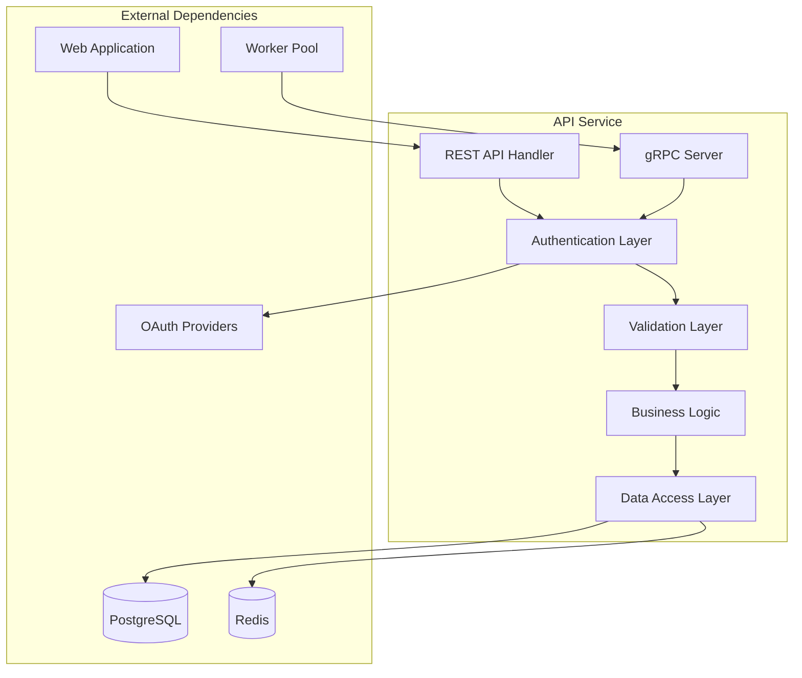
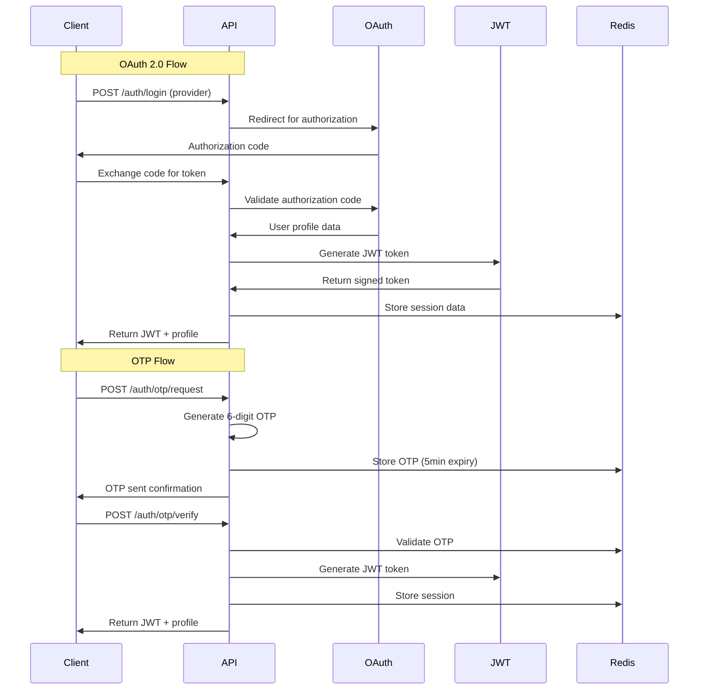
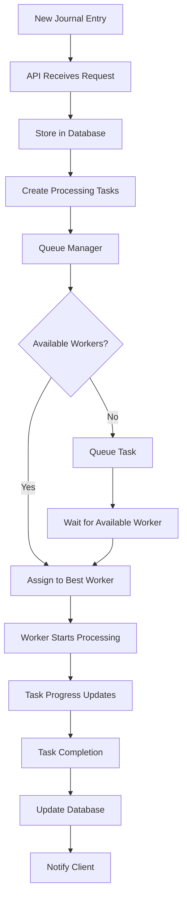

# API Service Design

**Version:** 1.0
**Date:** August 4, 2025
**Author:** Senior Staff Software Architect, Garnizeh
**Status:** In Progress

---

## 📋 Overview

The API Service acts as the central coordination hub for the EngLog system, providing RESTful endpoints for client applications and gRPC coordination for the worker pool. It handles user authentication, journal data management, task assignment, and serves as the primary interface for all client interactions.

## 🏗️ Architecture

### Core Responsibilities

1. **Client Interface:** RESTful API endpoints for web application communication
2. **Authentication & Authorization:** JWT-based security with OAuth 2.0 and OTP support
3. **Data Management:** Journal entry storage and retrieval using PostgreSQL
4. **Worker Coordination:** gRPC server for worker pool management and task assignment
5. **Caching Strategy:** Redis integration for performance optimization
6. **Rate Limiting:** Request throttling and abuse prevention

### Service Boundaries



## 🔌 API Design

### Base Configuration

- **Base URL:** `https://api.englog.com/api/v1`
- **Protocol:** HTTPS only
- **Content Type:** `application/json`
- **Authentication:** Bearer JWT tokens
- **Rate Limiting:** 1000 requests/hour per authenticated user

### Core Endpoint Groups

#### Authentication Endpoints

```
POST /auth/login              # OAuth login or email/password login
POST /auth/otp/request        # Request OTP for email-based authentication
POST /auth/otp/verify         # Verify OTP and complete authentication
POST /auth/refresh            # Refresh JWT tokens
POST /auth/logout             # Logout and invalidate tokens
GET  /auth/profile            # Get user profile information
```

#### Journal Management Endpoints

```
GET    /journals              # List user's journals (paginated)
POST   /journals              # Create new journal entry (accepts any JSON)
GET    /journals/{id}         # Get specific journal entry with raw data
PUT    /journals/{id}         # Update journal entry (accepts any JSON)
DELETE /journals/{id}         # Delete journal entry
GET    /journals/{id}/processed # Get all processed content for entry
```

#### Group Management Endpoints

```
GET    /groups                # List user's groups with membership info
POST   /groups                # Create new group (user becomes owner)
GET    /groups/{id}           # Get specific group details and membership
PUT    /groups/{id}           # Update group settings (owner/admin only)
DELETE /groups/{id}           # Delete group (owner only)
GET    /groups/{id}/analytics # Group-wide analytics and insights
```

#### Tag System Endpoints

```
GET    /tags                  # List available tags (with scope filtering)
POST   /tags                  # Create new tag
GET    /tags/{id}             # Get specific tag details and usage stats
PUT    /tags/{id}             # Update tag properties
DELETE /tags/{id}             # Delete tag
GET    /tags/suggestions      # Get AI-suggested tags for content
POST   /tags/assign           # Assign tag(s) to entity (journal, group, etc.)
```

### Request/Response Schemas

#### Journal Entry Schema

```json
{
  "id": "uuid",
  "user_id": "uuid",
  "raw_data": {
    // Any JSON structure accepted
    "content": "Today was a great day...",
    "mood": 8,
    "location": { "lat": 40.7128, "lng": -74.006 },
    "tags": ["productivity", "work"],
    "custom_field": "any value"
  },
  "entry_type": "text|voice|photo|mixed",
  "metadata": {
    "source": "web_app",
    "client_version": "1.0.0",
    "ip_address": "192.168.1.1"
  },
  "created_at": "2025-08-04T14:30:00Z",
  "updated_at": "2025-08-04T14:30:00Z",
  "processing_status": "pending|processing|completed|failed"
}
```

#### Processed Content Schema

```json
{
  "id": "uuid",
  "journal_id": "uuid",
  "user_id": "uuid",
  "task_type": "sentiment_analysis|content_extraction|theme_identification",
  "processed_data": {
    // Task-specific results
    "overall_sentiment": { "score": 0.8, "label": "positive" },
    "emotions": { "joy": 0.8, "sadness": 0.1 },
    "themes": ["productivity", "workplace", "achievement"]
  },
  "confidence_score": 0.92,
  "ai_provider_info": {
    "provider": "openai",
    "model": "gpt-4-turbo",
    "tokens_used": 150
  },
  "created_at": "2025-08-04T14:35:00Z"
}
```

#### Error Response Schema

```json
{
  "error": {
    "code": "VALIDATION_ERROR|AUTH_ERROR|RESOURCE_NOT_FOUND|RATE_LIMIT_EXCEEDED",
    "message": "Human-readable error description",
    "timestamp": "2025-08-04T14:30:00Z",
    "request_id": "req_7f8e5a2b-3c4d-4e5f-8a9b-1c2d3e4f5a6b",
    "details": {
      "field_errors": [
        {
          "field": "email",
          "message": "Invalid email format",
          "code": "INVALID_FORMAT"
        }
      ]
    },
    "suggested_actions": ["Verify email format follows RFC 5322 standard"]
  }
}
```

## 🔐 Authentication & Authorization

### Authentication Flow



### JWT Token Structure

```json
{
  "header": {
    "alg": "RS256",
    "typ": "JWT"
  },
  "payload": {
    "sub": "user_uuid",
    "iss": "api.englog.com",
    "aud": "englog_web",
    "exp": 1723567200,
    "iat": 1723563600,
    "scope": ["read:journals", "write:journals", "manage:groups"],
    "user_metadata": {
      "email": "user@example.com",
      "name": "John Doe",
      "timezone": "America/New_York"
    }
  }
}
```

### Permission Model

- **Scope-based Authorization:** JWT tokens include specific scopes for fine-grained access control
- **Resource-level Permissions:** Each resource (journal, group) has owner and permission checks
- **Group-based Access:** Group membership determines access to shared resources
- **Rate Limiting per User:** Different limits based on user type and authentication method

## 🔄 gRPC Worker Coordination

### gRPC Service Definition

```protobuf
syntax = "proto3";

service WorkerCoordinator {
  // Worker registration and lifecycle
  rpc RegisterWorker(WorkerRegistration) returns (RegistrationResponse);
  rpc Heartbeat(HeartbeatRequest) returns (HeartbeatResponse);
  rpc UnregisterWorker(WorkerID) returns (UnregisterResponse);

  // Task management
  rpc GetTask(TaskRequest) returns (TaskAssignment);
  rpc ReportTaskStart(TaskStatusUpdate) returns (StatusResponse);
  rpc ReportTaskProgress(TaskProgressUpdate) returns (StatusResponse);
  rpc ReportTaskComplete(TaskCompletion) returns (StatusResponse);
  rpc ReportTaskError(TaskError) returns (StatusResponse);

  // Health and monitoring
  rpc GetWorkerStats(WorkerStatsRequest) returns (WorkerStatsResponse);
  rpc GetQueueStatus(QueueStatusRequest) returns (QueueStatusResponse);
}

message TaskAssignment {
  string task_id = 1;
  string task_type = 2;
  string journal_id = 3;
  string user_id = 4;
  google.protobuf.Any task_data = 5;
  map<string, string> context = 6;
  int32 priority = 7;
  google.protobuf.Timestamp deadline = 8;
}
```

### Task Assignment Strategy



### Worker Selection Algorithm

1. **Capability Matching:** Match task type with worker capabilities
2. **Load Balancing:** Prefer workers with lower current task count
3. **Health Status:** Only assign to healthy, responsive workers
4. **Priority Handling:** High-priority tasks get preferential assignment
5. **Fallback Strategy:** Retry with different workers on failure

## 💾 Data Layer Integration

### Database Schema Design

```sql
-- Users table
CREATE TABLE users (
    id UUID PRIMARY KEY DEFAULT gen_random_uuid(),
    email VARCHAR(255) UNIQUE NOT NULL,
    name VARCHAR(255),
    auth_provider VARCHAR(50),
    auth_provider_id VARCHAR(255),
    preferences JSONB DEFAULT '{}',
    created_at TIMESTAMP WITH TIME ZONE DEFAULT NOW(),
    updated_at TIMESTAMP WITH TIME ZONE DEFAULT NOW()
);

-- Journal entries table
CREATE TABLE journal_entries (
    id UUID PRIMARY KEY DEFAULT gen_random_uuid(),
    user_id UUID NOT NULL REFERENCES users(id) ON DELETE CASCADE,
    raw_data JSONB NOT NULL,
    entry_type VARCHAR(50) DEFAULT 'text',
    metadata JSONB DEFAULT '{}',
    processing_status VARCHAR(20) DEFAULT 'pending',
    created_at TIMESTAMP WITH TIME ZONE DEFAULT NOW(),
    updated_at TIMESTAMP WITH TIME ZONE DEFAULT NOW()
);

-- Processed content table
CREATE TABLE processed_content (
    id UUID PRIMARY KEY DEFAULT gen_random_uuid(),
    journal_id UUID NOT NULL REFERENCES journal_entries(id) ON DELETE CASCADE,
    user_id UUID NOT NULL REFERENCES users(id) ON DELETE CASCADE,
    task_type VARCHAR(100) NOT NULL,
    processed_data JSONB NOT NULL,
    confidence_score DECIMAL(3,2),
    ai_provider_info JSONB,
    created_at TIMESTAMP WITH TIME ZONE DEFAULT NOW()
);

-- Create indexes for performance
CREATE INDEX idx_journal_entries_user_id ON journal_entries(user_id);
CREATE INDEX idx_journal_entries_created_at ON journal_entries(created_at);
CREATE INDEX idx_processed_content_journal_id ON processed_content(journal_id);
CREATE INDEX idx_processed_content_task_type ON processed_content(task_type);
```

### Redis Caching Strategy

```go
// Cache key patterns
const (
    UserSessionPrefix     = "session:user:"
    OTPPrefix            = "otp:email:"
    ProcessedContentKey  = "processed:journal:"
    UserJournalsKey      = "journals:user:"
    RateLimitKey         = "rate_limit:user:"
)

// Cache TTL configurations
var CacheTTL = map[string]time.Duration{
    "user_session":      24 * time.Hour,
    "otp_code":         5 * time.Minute,
    "processed_content": 1 * time.Hour,
    "user_journals":    15 * time.Minute,
    "rate_limit":       1 * time.Hour,
}
```

## 🛡️ Security Implementation

### Input Validation

- **JSON Schema Validation:** Validate all incoming JSON against defined schemas
- **SQL Injection Prevention:** Use parameterized queries and prepared statements
- **XSS Protection:** Sanitize and escape user input before processing
- **Rate Limiting:** Implement per-user and per-endpoint rate limits
- **CORS Configuration:** Strict CORS policies for cross-origin requests

### Data Protection

- **Encryption at Rest:** Database encryption for sensitive user data
- **Encryption in Transit:** TLS 1.3 for all API communications
- **JWT Security:** RS256 signing with regular key rotation
- **Session Management:** Secure session storage with automatic expiration
- **Audit Logging:** Comprehensive logging of all data access and modifications

## 📊 Monitoring & Observability

### Metrics Collection

```go
// Prometheus metrics
var (
    RequestDuration = prometheus.NewHistogramVec(
        prometheus.HistogramOpts{
            Name: "api_request_duration_seconds",
            Help: "HTTP request duration in seconds",
        },
        []string{"method", "endpoint", "status_code"},
    )

    ActiveWorkers = prometheus.NewGauge(
        prometheus.GaugeOpts{
            Name: "active_workers_total",
            Help: "Number of active worker nodes",
        },
    )

    TasksQueued = prometheus.NewGauge(
        prometheus.GaugeOpts{
            Name: "tasks_queued_total",
            Help: "Number of tasks currently queued",
        },
    )
)
```

### Structured Logging

```json
{
  "timestamp": "2025-08-04T14:30:00Z",
  "level": "INFO",
  "service": "api",
  "component": "auth",
  "operation": "login",
  "user_id": "uuid",
  "request_id": "req_123",
  "duration_ms": 150,
  "status": "success",
  "metadata": {
    "auth_provider": "google",
    "ip_address": "192.168.1.1"
  }
}
```

### Health Checks

```go
// Health check endpoints
GET /health           // Basic service health
GET /health/deep      // Deep health check with dependencies
GET /metrics          // Prometheus metrics endpoint
```

## 🚀 Performance Optimization

### Response Time Targets

- **Authentication:** < 200ms for token validation
- **Journal CRUD:** < 300ms for basic operations
- **Search/Filter:** < 500ms for complex queries
- **Task Assignment:** < 100ms for worker coordination

### Caching Strategy

1. **User Sessions:** Redis cache with 24-hour TTL
2. **Processed Content:** Cache expensive AI results for 1 hour
3. **Journal Lists:** Cache paginated results for 15 minutes
4. **Worker Registry:** In-memory cache with 30-second refresh
5. **Rate Limit Counters:** Redis counters with sliding window

### Database Optimization

- **Connection Pooling:** Optimized connection pool with health checks
- **Query Optimization:** Indexed queries and prepared statements
- **Read Replicas:** Route read queries to replica databases
- **Batch Operations:** Bulk insert/update for improved throughput

## 🔄 Error Handling & Resilience

### Circuit Breaker Pattern

```go
// Circuit breaker for external dependencies
type CircuitBreaker struct {
    FailureThreshold int
    RecoveryTimeout  time.Duration
    State           string // "closed", "open", "half-open"
}

// Example: Database circuit breaker
dbCircuitBreaker := NewCircuitBreaker(5, 30*time.Second)
```

### Retry Strategies

- **Database Operations:** Exponential backoff with jitter
- **External API Calls:** 3 retries with increasing delays
- **Worker Communication:** Immediate retry, then circuit breaker
- **Cache Operations:** Fail-fast with graceful degradation

### Graceful Degradation

1. **Cache Failures:** Serve from database with warning
2. **Worker Unavailable:** Queue tasks for later processing
3. **External AI Down:** Use local models or defer processing
4. **Database Issues:** Return cached results with stale data indicator

---

## 🔗 Related Documents

- **[Worker Pool Design](./WORKER_POOL.md)** - Distributed processing architecture
- **[Database Design](./DATABASE.md)** - Complete database schema and strategies
- **[Authentication](../design/AUTHENTICATION.md)** - Detailed authentication flows
- **[Security](../operations/SECURITY.md)** - Comprehensive security considerations
- **[Monitoring](../operations/MONITORING.md)** - Observability and alerting setup

---

**Document Status:** 🚧 In Progress
**Next Review:** 2025-09-04
**Last Updated:** 2025-08-04

---

_This document details the API Service design and implementation strategy. It serves as the technical specification for developers implementing the central coordination service._
