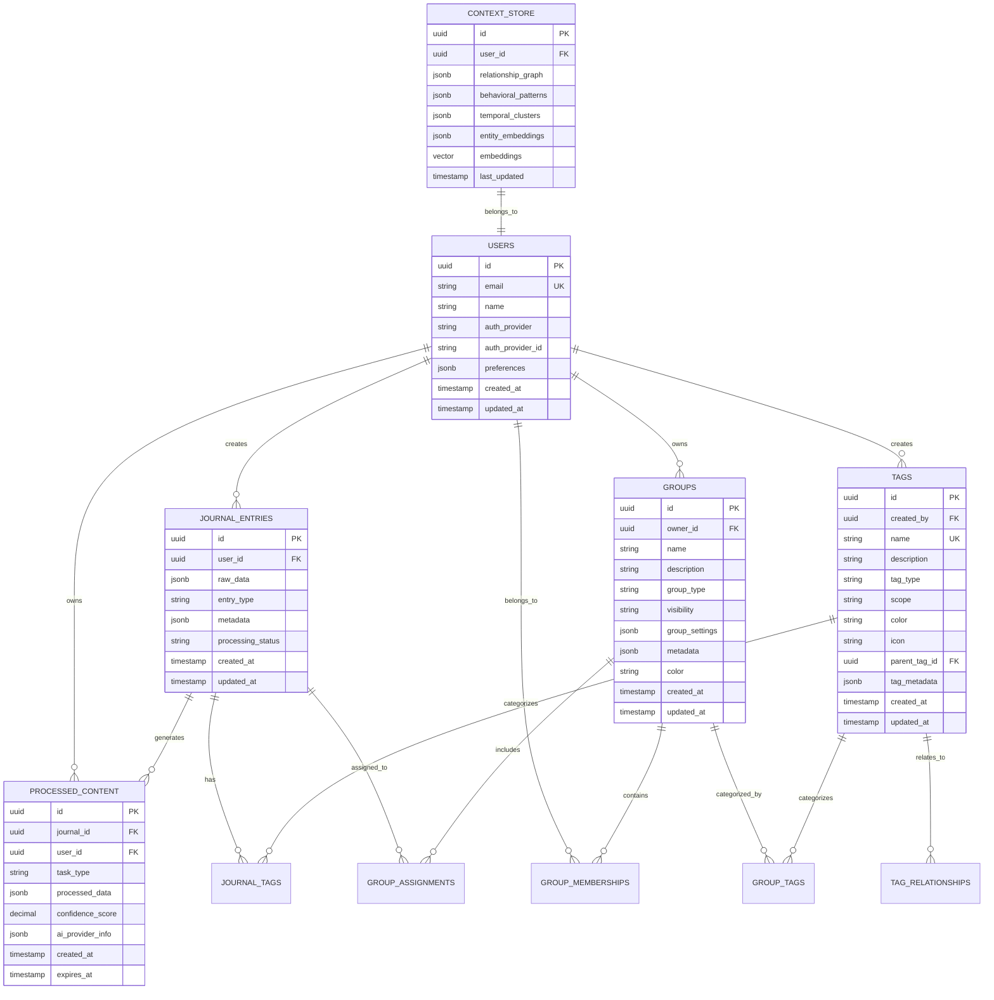

# Database Design

**Version:** 1.0
**Date:** August 4, 2025
**Author:** Senior Staff Software Architect, Garnizeh
**Status:** In Progress

---

## 📋 Overview

The EngLog database architecture is built on PostgreSQL with JSONB for flexible document storage and pgvector extension for semantic search capabilities. The design supports unstructured journal data while maintaining relational integrity for user management, groups, and processed content.

## 🏗️ Database Architecture

### Technology Stack

- **Primary Database:** PostgreSQL 17+
- **JSON Support:** JSONB for flexible schema storage
- **Vector Search:** pgvector extension for embeddings
- **Code Generation:** SQLC for type-safe Go code
- **Migrations:** Database migration management
- **Caching:** Redis for frequently accessed data

### Core Design Principles

1. **Flexible Schema:** JSONB storage for unstructured journal data
2. **Relational Integrity:** Traditional relations for core entities
3. **Performance Optimization:** Strategic indexing and caching
4. **Audit Trail:** Comprehensive change tracking
5. **Data Privacy:** Row-level security and encryption
6. **Scalability:** Read replicas and partitioning strategies

## 📊 Entity Relationship Diagram



## 🗄️ Schema Definitions

### Core Tables

#### Users Table

```sql
CREATE TABLE users (
    id UUID PRIMARY KEY DEFAULT gen_random_uuid(),
    email VARCHAR(255) UNIQUE NOT NULL,
    name VARCHAR(255),
    auth_provider VARCHAR(50), -- 'google', 'github', 'microsoft', 'otp'
    auth_provider_id VARCHAR(255),
    preferences JSONB DEFAULT '{}',
    created_at TIMESTAMP WITH TIME ZONE DEFAULT NOW(),
    updated_at TIMESTAMP WITH TIME ZONE DEFAULT NOW()
);

-- User preferences schema
-- {
--   "timezone": "America/New_York",
--   "language": "en",
--   "ai_processing": {
--     "enabled": true,
--     "providers": ["openai", "azure"],
--     "analysis_depth": "detailed"
--   },
--   "privacy": {
--     "data_sharing": false,
--     "analytics_enabled": true
--   },
--   "notifications": {
--     "email_insights": true,
--     "processing_complete": false
--   }
-- }

CREATE UNIQUE INDEX idx_users_email ON users(email);
CREATE INDEX idx_users_auth_provider ON users(auth_provider, auth_provider_id);
```

#### Journal Entries Table

```sql
CREATE TABLE journal_entries (
    id UUID PRIMARY KEY DEFAULT gen_random_uuid(),
    user_id UUID NOT NULL REFERENCES users(id) ON DELETE CASCADE,
    raw_data JSONB NOT NULL,
    entry_type VARCHAR(50) DEFAULT 'text', -- 'text', 'voice', 'photo', 'mixed'
    metadata JSONB DEFAULT '{}',
    processing_status VARCHAR(20) DEFAULT 'pending', -- 'pending', 'processing', 'completed', 'failed'
    created_at TIMESTAMP WITH TIME ZONE DEFAULT NOW(),
    updated_at TIMESTAMP WITH TIME ZONE DEFAULT NOW()
);

-- Metadata schema example
-- {
--   "source": "web_app",
--   "client_version": "1.0.0",
--   "ip_address": "192.168.1.1",
--   "user_agent": "Mozilla/5.0...",
--   "location": {
--     "lat": 40.7128,
--     "lng": -74.0060,
--     "accuracy": 100
--   },
--   "word_count": 150,
--   "estimated_reading_time": 2
-- }

CREATE INDEX idx_journal_entries_user_id ON journal_entries(user_id);
CREATE INDEX idx_journal_entries_created_at ON journal_entries(created_at);
CREATE INDEX idx_journal_entries_processing_status ON journal_entries(processing_status);
CREATE INDEX idx_journal_entries_entry_type ON journal_entries(entry_type);

-- GIN index for raw_data JSONB queries
CREATE INDEX idx_journal_entries_raw_data_gin ON journal_entries USING GIN(raw_data);
```

#### Processed Content Table

```sql
CREATE TABLE processed_content (
    id UUID PRIMARY KEY DEFAULT gen_random_uuid(),
    journal_id UUID NOT NULL REFERENCES journal_entries(id) ON DELETE CASCADE,
    user_id UUID NOT NULL REFERENCES users(id) ON DELETE CASCADE,
    task_type VARCHAR(100) NOT NULL, -- 'sentiment_analysis', 'content_extraction', etc.
    processed_data JSONB NOT NULL,
    confidence_score DECIMAL(3,2) CHECK (confidence_score >= 0 AND confidence_score <= 1),
    ai_provider_info JSONB,
    created_at TIMESTAMP WITH TIME ZONE DEFAULT NOW(),
    expires_at TIMESTAMP WITH TIME ZONE -- For temporary results
);

-- AI provider info schema
-- {
--   "provider": "openai",
--   "model": "gpt-4-turbo",
--   "model_version": "2024-04-09",
--   "tokens_used": 150,
--   "cost_usd": 0.003,
--   "processing_time_ms": 1250,
--   "request_id": "req_abc123"
-- }

CREATE INDEX idx_processed_content_journal_id ON processed_content(journal_id);
CREATE INDEX idx_processed_content_user_id ON processed_content(user_id);
CREATE INDEX idx_processed_content_task_type ON processed_content(task_type);
CREATE INDEX idx_processed_content_created_at ON processed_content(created_at);

-- GIN index for processed_data JSONB queries
CREATE INDEX idx_processed_content_data_gin ON processed_content USING GIN(processed_data);

-- Composite index for efficient task-type queries
CREATE INDEX idx_processed_content_composite ON processed_content(user_id, task_type, created_at);
```

### Group System Tables

#### Groups Table

```sql
CREATE TABLE groups (
    id UUID PRIMARY KEY DEFAULT gen_random_uuid(),
    owner_id UUID NOT NULL REFERENCES users(id) ON DELETE CASCADE,
    name VARCHAR(255) NOT NULL,
    description TEXT,
    group_type VARCHAR(50) NOT NULL, -- 'personal', 'team', 'project', 'mixed'
    visibility VARCHAR(20) DEFAULT 'private', -- 'private', 'public', 'restricted'
    group_settings JSONB DEFAULT '{}',
    metadata JSONB DEFAULT '{}',
    color VARCHAR(7), -- Hex color code
    created_at TIMESTAMP WITH TIME ZONE DEFAULT NOW(),
    updated_at TIMESTAMP WITH TIME ZONE DEFAULT NOW()
);

-- Group settings schema
-- {
--   "auto_assignment": true,
--   "member_permissions": {
--     "can_invite": false,
--     "can_process": true,
--     "can_export": false
--   },
--   "processing_preferences": {
--     "sentiment_analysis": true,
--     "theme_identification": true,
--     "group_analytics": true
--   },
--   "retention_policy": {
--     "archive_after_days": 365,
--     "delete_after_days": null
--   }
-- }

CREATE INDEX idx_groups_owner_id ON groups(owner_id);
CREATE INDEX idx_groups_group_type ON groups(group_type);
CREATE INDEX idx_groups_visibility ON groups(visibility);
CREATE INDEX idx_groups_created_at ON groups(created_at);
```

#### Group Memberships Table

```sql
CREATE TABLE group_memberships (
    id UUID PRIMARY KEY DEFAULT gen_random_uuid(),
    group_id UUID NOT NULL REFERENCES groups(id) ON DELETE CASCADE,
    user_id UUID NOT NULL REFERENCES users(id) ON DELETE CASCADE,
    role VARCHAR(20) NOT NULL DEFAULT 'member', -- 'owner', 'admin', 'member', 'viewer'
    permissions JSONB DEFAULT '{}',
    joined_at TIMESTAMP WITH TIME ZONE DEFAULT NOW(),
    invited_by UUID REFERENCES users(id),
    invitation_accepted_at TIMESTAMP WITH TIME ZONE,

    UNIQUE(group_id, user_id)
);

-- Permissions schema
-- {
--   "read": true,
--   "write": true,
--   "manage": false,
--   "analyze": true,
--   "invite": false,
--   "export": false
-- }

CREATE INDEX idx_group_memberships_group_id ON group_memberships(group_id);
CREATE INDEX idx_group_memberships_user_id ON group_memberships(user_id);
CREATE INDEX idx_group_memberships_role ON group_memberships(role);
```

#### Group Assignments Table

```sql
CREATE TABLE group_assignments (
    id UUID PRIMARY KEY DEFAULT gen_random_uuid(),
    journal_id UUID NOT NULL REFERENCES journal_entries(id) ON DELETE CASCADE,
    group_id UUID NOT NULL REFERENCES groups(id) ON DELETE CASCADE,
    assigned_by UUID NOT NULL REFERENCES users(id),
    assignment_type VARCHAR(20) DEFAULT 'manual', -- 'manual', 'automatic', 'rule_based'
    permissions JSONB DEFAULT '{}',
    assigned_at TIMESTAMP WITH TIME ZONE DEFAULT NOW(),

    UNIQUE(journal_id, group_id)
);

CREATE INDEX idx_group_assignments_journal_id ON group_assignments(journal_id);
CREATE INDEX idx_group_assignments_group_id ON group_assignments(group_id);
CREATE INDEX idx_group_assignments_assigned_by ON group_assignments(assigned_by);
```

### Tag System Tables

#### Tags Table

```sql
CREATE TABLE tags (
    id UUID PRIMARY KEY DEFAULT gen_random_uuid(),
    created_by UUID NOT NULL REFERENCES users(id),
    name VARCHAR(100) NOT NULL,
    description TEXT,
    tag_type VARCHAR(20) DEFAULT 'user', -- 'system', 'user', 'team', 'auto'
    scope VARCHAR(20) DEFAULT 'private', -- 'private', 'group', 'public', 'system'
    color VARCHAR(7), -- Hex color code
    icon VARCHAR(50), -- Icon identifier
    parent_tag_id UUID REFERENCES tags(id),
    tag_metadata JSONB DEFAULT '{}',
    usage_count INTEGER DEFAULT 0,
    created_at TIMESTAMP WITH TIME ZONE DEFAULT NOW(),
    updated_at TIMESTAMP WITH TIME ZONE DEFAULT NOW(),

    UNIQUE(name, created_by, scope)
);

-- Tag metadata schema
-- {
--   "auto_suggestion": {
--     "enabled": true,
--     "keywords": ["sprint", "planning", "backlog"],
--     "confidence_threshold": 0.7
--   },
--   "validation_rules": {
--     "max_assignments": 100,
--     "allowed_entity_types": ["journal", "group"]
--   },
--   "team_settings": {
--     "team_id": "uuid",
--     "requires_approval": false,
--     "auto_expire_days": null
--   }
-- }

CREATE INDEX idx_tags_created_by ON tags(created_by);
CREATE INDEX idx_tags_name ON tags(name);
CREATE INDEX idx_tags_tag_type ON tags(tag_type);
CREATE INDEX idx_tags_scope ON tags(scope);
CREATE INDEX idx_tags_parent_tag_id ON tags(parent_tag_id);
CREATE INDEX idx_tags_usage_count ON tags(usage_count);

-- Full-text search index for tag names and descriptions
CREATE INDEX idx_tags_search ON tags USING GIN(to_tsvector('english', name || ' ' || COALESCE(description, '')));
```

#### Tag Assignments Table

```sql
CREATE TABLE tag_assignments (
    id UUID PRIMARY KEY DEFAULT gen_random_uuid(),
    tag_id UUID NOT NULL REFERENCES tags(id) ON DELETE CASCADE,
    entity_type VARCHAR(20) NOT NULL, -- 'journal', 'group', 'user'
    entity_id UUID NOT NULL,
    assigned_by UUID NOT NULL REFERENCES users(id),
    assignment_type VARCHAR(20) DEFAULT 'manual', -- 'manual', 'ai_suggested', 'auto_rule'
    assignment_context JSONB DEFAULT '{}',
    assigned_at TIMESTAMP WITH TIME ZONE DEFAULT NOW(),

    UNIQUE(tag_id, entity_type, entity_id)
);

-- Assignment context schema
-- {
--   "reason": "user_categorization",
--   "bulk_operation_id": "uuid",
--   "ai_suggestions": [
--     {
--       "tag_id": "uuid",
--       "confidence": 0.85,
--       "reasoning": "Content mentions sprint goals and team velocity"
--     }
--   ],
--   "rule_id": "uuid"
-- }

CREATE INDEX idx_tag_assignments_tag_id ON tag_assignments(tag_id);
CREATE INDEX idx_tag_assignments_entity ON tag_assignments(entity_type, entity_id);
CREATE INDEX idx_tag_assignments_assigned_by ON tag_assignments(assigned_by);
CREATE INDEX idx_tag_assignments_type ON tag_assignments(assignment_type);
```

#### Tag Relationships Table

```sql
CREATE TABLE tag_relationships (
    id UUID PRIMARY KEY DEFAULT gen_random_uuid(),
    parent_tag_id UUID NOT NULL REFERENCES tags(id) ON DELETE CASCADE,
    child_tag_id UUID NOT NULL REFERENCES tags(id) ON DELETE CASCADE,
    relationship_type VARCHAR(20) NOT NULL, -- 'parent_child', 'synonym', 'related', 'excludes'
    strength DECIMAL(3,2) DEFAULT 1.0, -- Relationship strength (0.0 to 1.0)
    created_by UUID NOT NULL REFERENCES users(id),
    created_at TIMESTAMP WITH TIME ZONE DEFAULT NOW(),

    UNIQUE(parent_tag_id, child_tag_id, relationship_type),
    CHECK(parent_tag_id != child_tag_id)
);

CREATE INDEX idx_tag_relationships_parent ON tag_relationships(parent_tag_id);
CREATE INDEX idx_tag_relationships_child ON tag_relationships(child_tag_id);
CREATE INDEX idx_tag_relationships_type ON tag_relationships(relationship_type);
```

### Context Store Table

```sql
-- Enable pgvector extension
CREATE EXTENSION IF NOT EXISTS vector;

CREATE TABLE context_store (
    id UUID PRIMARY KEY DEFAULT gen_random_uuid(),
    user_id UUID NOT NULL REFERENCES users(id) ON DELETE CASCADE,
    relationship_graph JSONB DEFAULT '{}',
    behavioral_patterns JSONB DEFAULT '{}',
    temporal_clusters JSONB DEFAULT '{}',
    entity_embeddings JSONB DEFAULT '{}',
    embeddings vector(1536), -- OpenAI embedding dimension
    last_updated TIMESTAMP WITH TIME ZONE DEFAULT NOW(),

    UNIQUE(user_id)
);

-- Relationship graph schema
-- {
--   "people": {
--     "john_doe": {
--       "strength": 0.9,
--       "interaction_frequency": "daily",
--       "sentiment_trend": 0.8,
--       "last_mentioned": "2025-08-04T14:30:00Z"
--     }
--   },
--   "places": {
--     "office": {
--       "visit_frequency": "weekdays",
--       "sentiment_association": 0.6,
--       "activity_types": ["work", "meetings"]
--     }
--   },
--   "concepts": {
--     "productivity": {
--       "mention_frequency": 0.3,
--       "sentiment_correlation": 0.7,
--       "related_activities": ["work", "planning"]
--     }
--   }
-- }

-- Vector similarity index
CREATE INDEX idx_context_store_embeddings ON context_store USING ivfflat (embeddings vector_cosine_ops);
CREATE INDEX idx_context_store_user_id ON context_store(user_id);
CREATE INDEX idx_context_store_last_updated ON context_store(last_updated);
```

## 🔍 Indexing Strategy

### Performance Indexes

```sql
-- Composite indexes for common query patterns
CREATE INDEX idx_journal_user_date ON journal_entries(user_id, created_at DESC);
CREATE INDEX idx_processed_user_task_date ON processed_content(user_id, task_type, created_at DESC);
CREATE INDEX idx_group_assignments_lookup ON group_assignments(group_id, journal_id);

-- Partial indexes for status-based queries
CREATE INDEX idx_journal_pending ON journal_entries(user_id, created_at)
WHERE processing_status = 'pending';

CREATE INDEX idx_journal_failed ON journal_entries(user_id, created_at)
WHERE processing_status = 'failed';

-- Text search indexes
CREATE INDEX idx_journal_content_search ON journal_entries
USING GIN((raw_data->>'content') gin_trgm_ops);

-- JSONB path indexes for common queries
CREATE INDEX idx_journal_mood ON journal_entries
USING BTREE((raw_data->>'mood')::numeric);

CREATE INDEX idx_journal_location ON journal_entries
USING GIN((raw_data->'location'));
```

### Query Optimization Examples

```sql
-- Efficient user journal retrieval with pagination
SELECT id, raw_data, created_at, processing_status
FROM journal_entries
WHERE user_id = $1
ORDER BY created_at DESC
LIMIT $2 OFFSET $3;

-- Get processed content for specific task types
SELECT pc.processed_data, pc.confidence_score, pc.created_at
FROM processed_content pc
JOIN journal_entries je ON pc.journal_id = je.id
WHERE je.user_id = $1
  AND pc.task_type = ANY($2)
ORDER BY pc.created_at DESC;

-- Group analytics query with member filtering
SELECT
    g.name,
    COUNT(DISTINCT je.id) as entry_count,
    AVG((pc.processed_data->>'overall_sentiment')::numeric) as avg_sentiment
FROM groups g
JOIN group_memberships gm ON g.id = gm.group_id
JOIN group_assignments ga ON g.id = ga.group_id
JOIN journal_entries je ON ga.journal_id = je.id
LEFT JOIN processed_content pc ON je.id = pc.journal_id
    AND pc.task_type = 'sentiment_analysis'
WHERE gm.user_id = $1
GROUP BY g.id, g.name;
```

## 💾 Data Management Strategies

### Partitioning Strategy

```sql
-- Partition journal_entries by creation date (monthly)
CREATE TABLE journal_entries_template (
    LIKE journal_entries INCLUDING ALL
) PARTITION BY RANGE (created_at);

-- Create monthly partitions
CREATE TABLE journal_entries_2025_08 PARTITION OF journal_entries_template
FOR VALUES FROM ('2025-08-01') TO ('2025-09-01');

CREATE TABLE journal_entries_2025_09 PARTITION OF journal_entries_template
FOR VALUES FROM ('2025-09-01') TO ('2025-10-01');

-- Automatic partition creation function
CREATE OR REPLACE FUNCTION create_monthly_partition(table_name text, start_date date)
RETURNS void AS $$
DECLARE
    partition_name text;
    start_month text;
    end_date date;
BEGIN
    start_month := to_char(start_date, 'YYYY_MM');
    partition_name := table_name || '_' || start_month;
    end_date := start_date + interval '1 month';

    EXECUTE format('CREATE TABLE %I PARTITION OF %I FOR VALUES FROM (%L) TO (%L)',
                   partition_name, table_name, start_date, end_date);
END;
$$ LANGUAGE plpgsql;
```

### Archival Strategy

```sql
-- Archive old processed content
CREATE TABLE processed_content_archive (
    LIKE processed_content INCLUDING ALL
);

-- Move data older than 1 year to archive
WITH archived_data AS (
    DELETE FROM processed_content
    WHERE created_at < NOW() - INTERVAL '1 year'
    RETURNING *
)
INSERT INTO processed_content_archive
SELECT * FROM archived_data;
```

### Backup and Recovery

```sql
-- Point-in-time recovery setup
ALTER SYSTEM SET wal_level = 'replica';
ALTER SYSTEM SET archive_mode = 'on';
ALTER SYSTEM SET archive_command = 'cp %p /backup/archive/%f';
ALTER SYSTEM SET max_wal_senders = 3;

-- Create backup script
#!/bin/bash
BACKUP_DIR="/backup/$(date +%Y%m%d_%H%M%S)"
pg_basebackup -D "$BACKUP_DIR" -Ft -z -P -U backup_user

# Retention policy: keep 7 daily, 4 weekly, 12 monthly backups
find /backup -name "*.tar.gz" -mtime +7 -delete
```

## 🔒 Security Implementation

### Row Level Security

```sql
-- Enable RLS on sensitive tables
ALTER TABLE journal_entries ENABLE ROW LEVEL SECURITY;
ALTER TABLE processed_content ENABLE ROW LEVEL SECURITY;
ALTER TABLE groups ENABLE ROW LEVEL SECURITY;

-- Users can only access their own journal entries
CREATE POLICY journal_entries_user_policy ON journal_entries
FOR ALL TO application_role
USING (user_id = current_setting('app.current_user_id')::uuid);

-- Group access based on membership
CREATE POLICY groups_member_policy ON groups
FOR SELECT TO application_role
USING (
    id IN (
        SELECT group_id FROM group_memberships
        WHERE user_id = current_setting('app.current_user_id')::uuid
    )
);
```

### Data Encryption

```sql
-- Enable transparent data encryption for sensitive columns
CREATE EXTENSION IF NOT EXISTS pgcrypto;

-- Encrypt sensitive user data
ALTER TABLE users
ADD COLUMN email_encrypted BYTEA;

-- Encryption functions
CREATE OR REPLACE FUNCTION encrypt_email(email_text TEXT)
RETURNS BYTEA AS $$
BEGIN
    RETURN pgp_sym_encrypt(email_text, current_setting('app.encryption_key'));
END;
$$ LANGUAGE plpgsql SECURITY DEFINER;

CREATE OR REPLACE FUNCTION decrypt_email(encrypted_data BYTEA)
RETURNS TEXT AS $$
BEGIN
    RETURN pgp_sym_decrypt(encrypted_data, current_setting('app.encryption_key'));
END;
$$ LANGUAGE plpgsql SECURITY DEFINER;
```

### Audit Logging

```sql
-- Audit log table
CREATE TABLE audit_log (
    id UUID PRIMARY KEY DEFAULT gen_random_uuid(),
    table_name VARCHAR(50) NOT NULL,
    operation VARCHAR(10) NOT NULL, -- 'INSERT', 'UPDATE', 'DELETE'
    user_id UUID,
    old_values JSONB,
    new_values JSONB,
    changed_at TIMESTAMP WITH TIME ZONE DEFAULT NOW(),
    session_id VARCHAR(255),
    ip_address INET
);

-- Audit trigger function
CREATE OR REPLACE FUNCTION audit_trigger_function()
RETURNS TRIGGER AS $$
BEGIN
    IF TG_OP = 'DELETE' THEN
        INSERT INTO audit_log(table_name, operation, user_id, old_values)
        VALUES (TG_TABLE_NAME, TG_OP, OLD.user_id, row_to_json(OLD));
        RETURN OLD;
    ELSIF TG_OP = 'UPDATE' THEN
        INSERT INTO audit_log(table_name, operation, user_id, old_values, new_values)
        VALUES (TG_TABLE_NAME, TG_OP, NEW.user_id, row_to_json(OLD), row_to_json(NEW));
        RETURN NEW;
    ELSIF TG_OP = 'INSERT' THEN
        INSERT INTO audit_log(table_name, operation, user_id, new_values)
        VALUES (TG_TABLE_NAME, TG_OP, NEW.user_id, row_to_json(NEW));
        RETURN NEW;
    END IF;
    RETURN NULL;
END;
$$ LANGUAGE plpgsql;

-- Apply audit triggers to sensitive tables
CREATE TRIGGER journal_entries_audit
AFTER INSERT OR UPDATE OR DELETE ON journal_entries
FOR EACH ROW EXECUTE FUNCTION audit_trigger_function();
```

## 📈 Performance Monitoring

### Database Metrics

```sql
-- Create monitoring views
CREATE VIEW database_performance AS
SELECT
    schemaname,
    tablename,
    seq_scan,
    seq_tup_read,
    idx_scan,
    idx_tup_fetch,
    n_tup_ins,
    n_tup_upd,
    n_tup_del
FROM pg_stat_user_tables
ORDER BY seq_scan DESC;

-- Query performance monitoring
CREATE VIEW slow_queries AS
SELECT
    query,
    calls,
    total_time,
    mean_time,
    rows,
    100.0 * shared_blks_hit / nullif(shared_blks_hit + shared_blks_read, 0) AS hit_percent
FROM pg_stat_statements
ORDER BY total_time DESC
LIMIT 20;

-- Index usage analysis
CREATE VIEW index_usage AS
SELECT
    schemaname,
    tablename,
    indexname,
    idx_scan,
    idx_tup_read,
    idx_tup_fetch
FROM pg_stat_user_indexes
ORDER BY idx_scan DESC;
```

### Automated Maintenance

```sql
-- Automated statistics update
CREATE OR REPLACE FUNCTION update_table_statistics()
RETURNS void AS $$
DECLARE
    table_record RECORD;
BEGIN
    FOR table_record IN
        SELECT schemaname, tablename
        FROM pg_tables
        WHERE schemaname = 'public'
    LOOP
        EXECUTE format('ANALYZE %I.%I', table_record.schemaname, table_record.tablename);
    END LOOP;
END;
$$ LANGUAGE plpgsql;

-- Schedule statistics updates
SELECT cron.schedule('update-stats', '0 2 * * *', 'SELECT update_table_statistics();');

-- Automated vacuum for large tables
SELECT cron.schedule('vacuum-large-tables', '0 3 * * 0',
    'VACUUM ANALYZE journal_entries, processed_content;');
```

## 🔄 Migration Strategy

### Schema Versioning

```sql
-- Migration tracking table
CREATE TABLE schema_migrations (
    version VARCHAR(20) PRIMARY KEY,
    applied_at TIMESTAMP WITH TIME ZONE DEFAULT NOW(),
    rollback_sql TEXT
);

-- Migration script template
-- migrations/001_initial_schema.sql
BEGIN;

-- Migration code here
CREATE TABLE IF NOT EXISTS users (...);

-- Record migration
INSERT INTO schema_migrations (version, rollback_sql)
VALUES ('001', 'DROP TABLE users CASCADE;');

COMMIT;
```

### Data Migration Procedures

```go
// Go migration framework integration
type Migration struct {
    Version   string
    Up        func(*sql.DB) error
    Down      func(*sql.DB) error
}

var migrations = []Migration{
    {
        Version: "001_initial_schema",
        Up: func(db *sql.DB) error {
            return execSQLFile(db, "migrations/001_initial_schema.sql")
        },
        Down: func(db *sql.DB) error {
            return execSQLFile(db, "migrations/001_rollback.sql")
        },
    },
}
```

---

## 🔗 Related Documents

- **[API Service Design](./API_SERVICE.md)** - Database integration patterns
- **[Worker Pool Design](./WORKER_POOL.md)** - Data processing workflows
- **[Security](../operations/SECURITY.md)** - Database security measures
- **[Monitoring](../operations/MONITORING.md)** - Database monitoring setup

---

**Document Status:** 🚧 In Progress
**Next Review:** 2025-09-04
**Last Updated:** 2025-08-04

---

_This document details the database design and data management strategies for the EngLog system. It serves as the technical specification for implementing the data layer._
