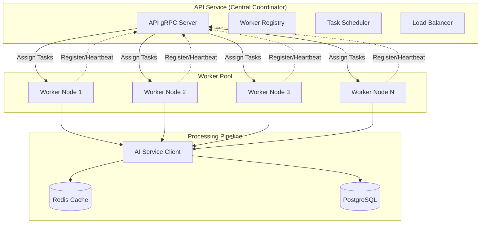
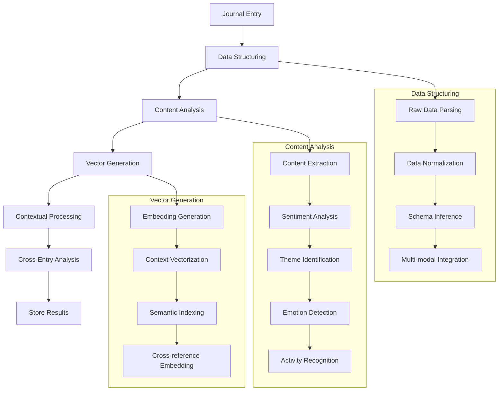
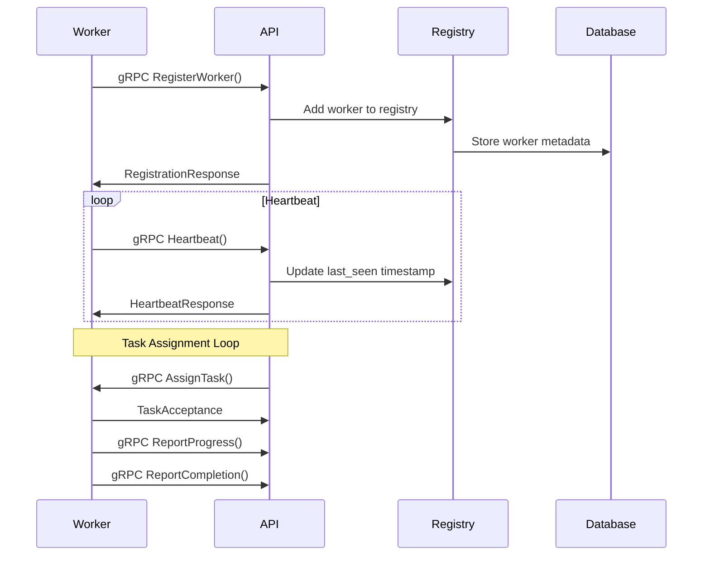
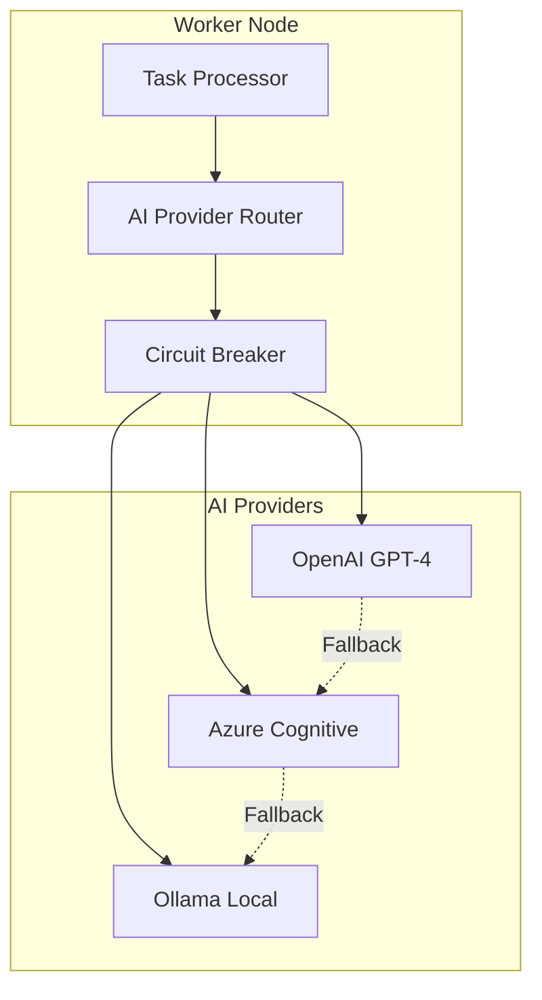

# Worker Pool Design

**Version:** 1.0
**Date:** August 4, 2025
**Author:** Senior Staff Software Architect, Garnizeh
**Status:** In Progress

---

## 📋 Overview

The Worker Pool is a distributed processing system that handles AI-powered analysis of journal entries. Workers register with the API Service via gRPC clients and receive task assignments for processing unstructured journal data through various AI services. The architecture supports horizontal scaling and fault tolerance through a centralized coordination model.

## 🏗️ Architecture

### Centralized Coordination Model

The Worker Pool operates with the API Service as the central coordinator, maintaining a registry of available workers and distributing tasks based on worker capabilities and current load.



### Core Components

#### 1. Worker Node

Each worker node is a standalone Go service that:

- Registers with the API Service on startup
- Maintains heartbeat connection via gRPC
- Advertises processing capabilities
- Accepts task assignments
- Reports processing status and results

#### 2. Task Scheduler (API Service)

The centralized scheduler:

- Maintains registry of available workers
- Assigns tasks based on capabilities and load
- Monitors worker health and status
- Handles task reassignment on failures
- Provides task queue management

#### 3. Processing Engine

Each worker contains:

- AI service clients (OpenAI, Azure, Ollama)
- Content analysis pipeline
- Vector generation capabilities
- Error handling and retry logic
- Result caching and storage

## 🔄 Processing Workflows

### Task Types and Processing Pipeline



### 1. Data Structuring Tasks

**Raw Data Parsing:**

- Convert unstructured user input into structured JSON
- Handle text, voice transcripts, image descriptions
- Normalize data formats and field names

**Data Normalization:**

- Standardize and clean raw journal data
- Apply consistent formatting and validation
- Extract metadata and context information

**Schema Inference:**

- Automatically infer appropriate JSON schemas
- Apply content-type specific processing rules
- Maintain data type consistency

**Multi-modal Integration:**

- Combine text, audio, and image content
- Create unified representations
- Preserve content relationships

### 2. Content Analysis Tasks

**Content Extraction:**

```json
{
  "task_type": "content_extraction",
  "processed_data": {
    "extracted_text": "Today was a productive day at work...",
    "key_phrases": ["productive day", "work", "team meeting"],
    "entities": [
      { "text": "work", "type": "LOCATION", "confidence": 0.8 },
      { "text": "team meeting", "type": "EVENT", "confidence": 0.9 }
    ],
    "word_count": 250,
    "reading_time_minutes": 2
  },
  "confidence_score": 0.95
}
```

**Sentiment Analysis:**

```json
{
  "task_type": "sentiment_analysis",
  "processed_data": {
    "overall_sentiment": {
      "score": 0.8,
      "label": "positive",
      "magnitude": 0.9
    },
    "emotions": {
      "joy": 0.8,
      "sadness": 0.1,
      "anger": 0.0,
      "fear": 0.1,
      "surprise": 0.0
    },
    "emotional_intensity": 0.75
  },
  "confidence_score": 0.92
}
```

**Theme Identification:**

```json
{
  "task_type": "theme_identification",
  "processed_data": {
    "primary_themes": [
      { "theme": "work_productivity", "confidence": 0.9 },
      { "theme": "team_collaboration", "confidence": 0.8 },
      { "theme": "personal_growth", "confidence": 0.7 }
    ],
    "topic_distribution": {
      "work": 0.6,
      "personal": 0.3,
      "social": 0.1
    },
    "related_concepts": ["achievement", "teamwork", "goals"]
  },
  "confidence_score": 0.88
}
```

### 3. Vector Generation Tasks

**Embedding Generation:**

- Create semantic embeddings for text content
- Use OpenAI text-embedding-ada-002 or similar models
- Store vectors in PostgreSQL with pgvector extension
- Enable semantic similarity search

**Context Vectorization:**

- Generate embeddings for user context and relationships
- Create vector representations of behavioral patterns
- Encode temporal and emotional context
- Support context-aware recommendations

### 4. Contextual Processing

**User Context Integration:**

```json
{
  "user_context": {
    "timezone": "America/New_York",
    "language": "en",
    "preferences": {
      "analysis_depth": "detailed",
      "privacy_level": "private"
    },
    "historical_patterns": {
      "typical_mood": 0.7,
      "activity_patterns": ["morning_work", "evening_reflection"],
      "frequent_themes": ["productivity", "family", "health"]
    }
  }
}
```

**Temporal Context:**

- Analyze entries from similar time periods
- Identify seasonal patterns and trends
- Compare with historical user behavior
- Detect significant changes or anomalies

**Relationship Context:**

- Connect entries through people, places, concepts
- Build relationship graphs and connections
- Identify recurring relationships and interactions
- Track relationship evolution over time

## 🚀 Worker Registration & Discovery

### Registration Flow



### Worker Capabilities

```go
type WorkerCapabilities struct {
    TaskTypes []string `json:"task_types"`
    AIProviders []string `json:"ai_providers"`
    MaxConcurrentTasks int `json:"max_concurrent_tasks"`
    ProcessingSpeed string `json:"processing_speed"` // "fast", "standard", "thorough"
    SpecializedFeatures []string `json:"specialized_features"`
}

// Example worker registration
{
  "worker_id": "worker-ai-001",
  "capabilities": {
    "task_types": [
      "sentiment_analysis",
      "content_extraction",
      "theme_identification",
      "embedding_generation"
    ],
    "ai_providers": ["openai", "azure"],
    "max_concurrent_tasks": 5,
    "processing_speed": "fast",
    "specialized_features": ["multi_language", "voice_processing"]
  },
  "resource_limits": {
    "cpu_cores": 4,
    "memory_gb": 8,
    "gpu_available": false
  }
}
```

## 📋 Task Assignment Strategy

### Assignment Algorithm

```go
func AssignTask(task *Task) (*Worker, error) {
    // 1. Filter workers by capability
    capableWorkers := filterByCapability(task.Type)

    // 2. Filter by health status
    healthyWorkers := filterByHealth(capableWorkers)

    // 3. Sort by current load
    sortedWorkers := sortByLoad(healthyWorkers)

    // 4. Apply priority rules
    if task.Priority == "high" {
        return selectHighPerformanceWorker(sortedWorkers)
    }

    // 5. Round-robin selection
    return selectRoundRobin(sortedWorkers)
}
```

### Load Balancing

- **Capability Matching:** Match task requirements with worker capabilities
- **Current Load:** Prefer workers with fewer active tasks
- **Health Status:** Only assign to healthy, responsive workers
- **Geographic Distribution:** Prefer workers in same region for latency
- **Specialization:** Route specialized tasks to optimized workers

### Priority Handling

```go
type TaskPriority int

const (
    PriorityLow    TaskPriority = 1
    PriorityNormal TaskPriority = 5
    PriorityHigh   TaskPriority = 10
    PriorityUrgent TaskPriority = 15
)

// Priority assignment rules
var PriorityRules = map[string]TaskPriority{
    "real_time_analysis": PriorityUrgent,
    "user_requested":     PriorityHigh,
    "batch_processing":   PriorityNormal,
    "background_cleanup": PriorityLow,
}
```

## 🔧 AI Integration Strategy

### Multi-Provider Architecture



### Provider Selection Logic

```go
type AIProvider interface {
    ProcessSentiment(text string) (*SentimentResult, error)
    ExtractThemes(text string) (*ThemeResult, error)
    GenerateEmbedding(text string) ([]float64, error)
    GetCapabilities() []string
    GetCostPerToken() float64
    GetLatency() time.Duration
}

func SelectProvider(task *Task) AIProvider {
    // Primary: OpenAI for complex analysis
    if task.RequiresAdvancedNLP() {
        return openAIProvider
    }

    // Secondary: Azure for standard tasks
    if task.IsStandardProcessing() {
        return azureProvider
    }

    // Fallback: Local Ollama for basic processing
    return ollamaProvider
}
```

### Prompt Engineering

**Standardized Prompts:**

```go
var PromptTemplates = map[string]string{
    "sentiment_analysis": `
Analyze the sentiment of the following journal entry.
Provide:
1. Overall sentiment score (-1 to 1)
2. Emotional breakdown (joy, sadness, anger, fear, surprise)
3. Confidence level

Journal Entry: {{.Content}}
`,

    "theme_identification": `
Identify the main themes and topics in this journal entry.
Provide:
1. Top 3 primary themes with confidence scores
2. Topic distribution percentages
3. Related concepts and keywords

Journal Entry: {{.Content}}
`,

    "insight_generation": `
Based on this journal entry and user context, generate insights.
Consider:
1. Patterns compared to historical entries
2. Emotional trends and changes
3. Actionable recommendations

Entry: {{.Content}}
Context: {{.UserContext}}
`
}
```

## 🛡️ Error Handling & Resilience

### Failure Scenarios

#### 1. Worker Node Failures

```go
func HandleWorkerFailure(workerID string) {
    // 1. Mark worker as unhealthy
    registry.MarkUnhealthy(workerID)

    // 2. Reassign active tasks
    activeTasks := getActiveTasks(workerID)
    for _, task := range activeTasks {
        reassignTask(task)
    }

    // 3. Remove from assignment pool
    registry.RemoveFromPool(workerID)

    // 4. Log failure for monitoring
    log.Error("Worker failure", "worker_id", workerID)
}
```

#### 2. AI Service Failures

```go
type CircuitBreaker struct {
    FailureCount    int
    LastFailureTime time.Time
    State          string // "closed", "open", "half-open"
}

func (cb *CircuitBreaker) Call(operation func() error) error {
    if cb.State == "open" {
        if time.Since(cb.LastFailureTime) > cb.RecoveryTimeout {
            cb.State = "half-open"
        } else {
            return ErrCircuitBreakerOpen
        }
    }

    err := operation()
    if err != nil {
        cb.recordFailure()
        return err
    }

    cb.recordSuccess()
    return nil
}
```

#### 3. Database Connection Issues

```go
func HandleDatabaseError(err error) (*ProcessingResult, error) {
    // 1. Check if temporary connection issue
    if isTemporaryError(err) {
        return retryWithBackoff(3, func() error {
            return saveProcessingResult(result)
        })
    }

    // 2. Cache results for later persistence
    if isCacheableError(err) {
        cacheResult(result)
        return result, ErrResultCached
    }

    // 3. Return error for manual intervention
    return nil, fmt.Errorf("database persistence failed: %w", err)
}
```

### Retry Strategies

**Exponential Backoff:**

```go
func RetryWithBackoff(maxRetries int, operation func() error) error {
    for attempt := 0; attempt < maxRetries; attempt++ {
        if err := operation(); err == nil {
            return nil
        }

        // Exponential backoff with jitter
        backoff := time.Duration(1<<attempt) * time.Second
        jitter := time.Duration(rand.Intn(1000)) * time.Millisecond
        time.Sleep(backoff + jitter)
    }
    return ErrMaxRetriesExceeded
}
```

## 📊 Performance Optimization

### Caching Strategy

```go
type ProcessingCache struct {
    Redis *redis.Client
    TTL   map[string]time.Duration
}

func (c *ProcessingCache) CacheResult(taskType, contentHash string, result *ProcessingResult) {
    key := fmt.Sprintf("processed:%s:%s", taskType, contentHash)
    ttl := c.TTL[taskType]

    data, _ := json.Marshal(result)
    c.Redis.Set(ctx, key, data, ttl)
}

func (c *ProcessingCache) GetCachedResult(taskType, contentHash string) (*ProcessingResult, error) {
    key := fmt.Sprintf("processed:%s:%s", taskType, contentHash)
    data, err := c.Redis.Get(ctx, key).Result()
    if err != nil {
        return nil, err
    }

    var result ProcessingResult
    json.Unmarshal([]byte(data), &result)
    return &result, nil
}
```

### Batch Processing

```go
func ProcessBatch(tasks []*Task) []*ProcessingResult {
    // Group tasks by type for efficient processing
    taskGroups := groupTasksByType(tasks)
    results := make([]*ProcessingResult, 0, len(tasks))

    for taskType, groupTasks := range taskGroups {
        batchResults := processBatchByType(taskType, groupTasks)
        results = append(results, batchResults...)
    }

    return results
}
```

### Resource Management

```go
type ResourceLimits struct {
    MaxConcurrentTasks int
    MaxMemoryUsage     int64 // bytes
    MaxCPUUsage        float64 // percentage
    MaxAIRequestsPerMin int
}

func (w *Worker) CheckResourceLimits() bool {
    // Check concurrent task limit
    if w.ActiveTasks >= w.Limits.MaxConcurrentTasks {
        return false
    }

    // Check memory usage
    if w.GetMemoryUsage() > w.Limits.MaxMemoryUsage {
        return false
    }

    // Check AI request rate limit
    if w.AIRequestCount() > w.Limits.MaxAIRequestsPerMin {
        return false
    }

    return true
}
```

## 📈 Monitoring & Metrics

### Worker Metrics

```go
var (
    TasksProcessed = prometheus.NewCounterVec(
        prometheus.CounterOpts{
            Name: "worker_tasks_processed_total",
            Help: "Total number of tasks processed by worker",
        },
        []string{"worker_id", "task_type", "status"},
    )

    ProcessingDuration = prometheus.NewHistogramVec(
        prometheus.HistogramOpts{
            Name: "worker_processing_duration_seconds",
            Help: "Task processing duration in seconds",
        },
        []string{"worker_id", "task_type"},
    )

    ActiveWorkers = prometheus.NewGauge(
        prometheus.GaugeOpts{
            Name: "active_workers_total",
            Help: "Number of active worker nodes",
        },
    )

    QueueDepth = prometheus.NewGauge(
        prometheus.GaugeOpts{
            Name: "task_queue_depth",
            Help: "Number of tasks in processing queue",
        },
    )
)
```

### Health Monitoring

```go
type WorkerHealth struct {
    WorkerID        string    `json:"worker_id"`
    Status          string    `json:"status"` // "healthy", "degraded", "unhealthy"
    LastHeartbeat   time.Time `json:"last_heartbeat"`
    ActiveTasks     int       `json:"active_tasks"`
    ProcessedToday  int       `json:"processed_today"`
    ErrorRate       float64   `json:"error_rate"`
    AvgProcessingTime time.Duration `json:"avg_processing_time"`
    ResourceUsage   ResourceUsage `json:"resource_usage"`
}

type ResourceUsage struct {
    CPUPercent    float64 `json:"cpu_percent"`
    MemoryMB      int64   `json:"memory_mb"`
    GoroutineCount int    `json:"goroutine_count"`
}
```

## 🔄 Scaling Strategy

### Horizontal Scaling

**Dynamic Worker Addition:**

```go
func ScaleWorkers(targetCount int) error {
    currentCount := registry.GetActiveWorkerCount()

    if targetCount > currentCount {
        // Scale up: Deploy new worker instances
        for range (targetCount - currentCount) {
            deployWorkerInstance()
        }
    } else if targetCount < currentCount {
        // Scale down: Gracefully remove workers
        workersToRemove := currentCount - targetCount
        removeWorkers(workersToRemove)
    }

    return nil
}
```

### Auto-scaling Triggers

```go
type AutoScalingConfig struct {
    MinWorkers          int
    MaxWorkers          int
    TargetQueueDepth    int
    ScaleUpThreshold    float64 // Queue depth percentage
    ScaleDownThreshold  float64
    CooldownPeriod      time.Duration
}

func (as *AutoScaler) EvaluateScaling() {
    queueDepth := getQueueDepth()
    activeWorkers := getActiveWorkerCount()

    utilizationRate := float64(queueDepth) / float64(activeWorkers * avgTasksPerWorker)

    if utilizationRate > as.Config.ScaleUpThreshold {
        as.scaleUp()
    } else if utilizationRate < as.Config.ScaleDownThreshold {
        as.scaleDown()
    }
}
```

---

## 🔗 Related Documents

- **[API Service Design](./API_SERVICE.md)** - Central coordination and gRPC server
- **[Database Design](./DATABASE.md)** - Data storage and retrieval strategies
- **[AI Integration](../design/AI_INTEGRATION.md)** - Detailed AI service integration
- **[Security](../operations/SECURITY.md)** - Worker security and isolation
- **[Monitoring](../operations/MONITORING.md)** - Worker monitoring and alerting

---

**Document Status:** 🚧 In Progress
**Next Review:** 2025-09-04
**Last Updated:** 2025-08-04

---

_This document details the Worker Pool design and distributed processing architecture. It serves as the technical specification for implementing the AI-powered processing engine._
