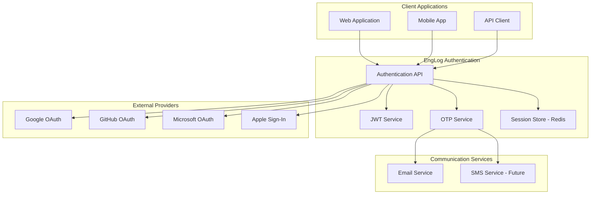
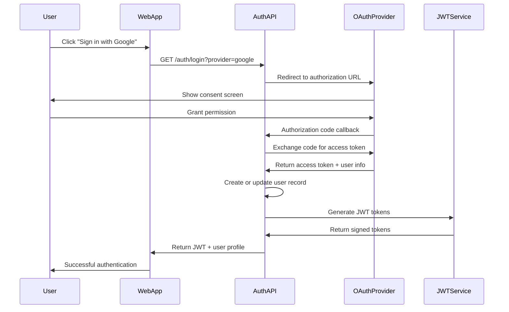
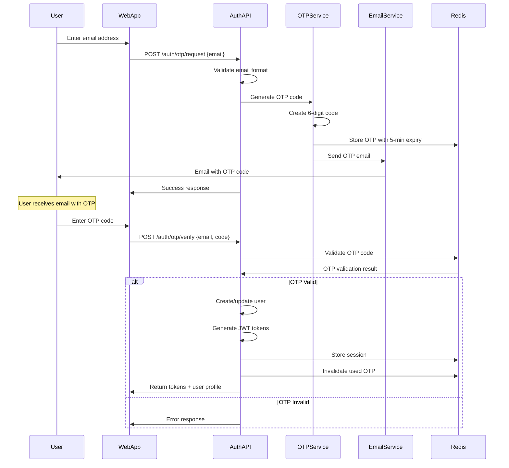

# Authentication Design

**Version:** 1.0
**Date:** August 4, 2025
**Author:** Senior Staff Software Architect, Garnizeh
**Status:** In Progress

---

## 📋 Overview

The EngLog authentication system implements a multi-modal approach supporting OAuth 2.0 providers and email-based OTP authentication. The design prioritizes security, user experience, and seamless integration with modern identity providers while maintaining a passwordless option for enhanced security.

## 🏗️ Authentication Architecture

### Core Components



### Authentication Methods

1. **OAuth 2.0 Integration**

   - Google, GitHub, Microsoft, Apple Sign-In
   - Industry-standard authorization flows
   - Secure token exchange

2. **Email-based OTP**

   - Passwordless authentication
   - 6-digit time-limited codes
   - Enhanced security with rate limiting

3. **JWT Token Management**
   - Stateless authentication tokens
   - Automatic token refresh
   - Secure token storage

## 🔐 OAuth 2.0 Implementation

### Authorization Code Flow



### OAuth Provider Configuration

```go
// OAuth provider configurations
type OAuthConfig struct {
    ClientID     string
    ClientSecret string
    RedirectURL  string
    Scopes       []string
    AuthURL      string
    TokenURL     string
    UserInfoURL  string
}

var OAuthProviders = map[string]OAuthConfig{
    "google": {
        ClientID:     os.Getenv("GOOGLE_CLIENT_ID"),
        ClientSecret: os.Getenv("GOOGLE_CLIENT_SECRET"),
        RedirectURL:  "https://api.englog.com/auth/callback/google",
        Scopes:       []string{"openid", "email", "profile"},
        AuthURL:      "https://accounts.google.com/o/oauth2/auth",
        TokenURL:     "https://oauth2.googleapis.com/token",
        UserInfoURL:  "https://www.googleapis.com/oauth2/v2/userinfo",
    },
    "github": {
        ClientID:     os.Getenv("GITHUB_CLIENT_ID"),
        ClientSecret: os.Getenv("GITHUB_CLIENT_SECRET"),
        RedirectURL:  "https://api.englog.com/auth/callback/github",
        Scopes:       []string{"user:email"},
        AuthURL:      "https://github.com/login/oauth/authorize",
        TokenURL:     "https://github.com/login/oauth/access_token",
        UserInfoURL:  "https://api.github.com/user",
    },
    "microsoft": {
        ClientID:     os.Getenv("MICROSOFT_CLIENT_ID"),
        ClientSecret: os.Getenv("MICROSOFT_CLIENT_SECRET"),
        RedirectURL:  "https://api.englog.com/auth/callback/microsoft",
        Scopes:       []string{"openid", "email", "profile"},
        AuthURL:      "https://login.microsoftonline.com/common/oauth2/v2.0/authorize",
        TokenURL:     "https://login.microsoftonline.com/common/oauth2/v2.0/token",
        UserInfoURL:  "https://graph.microsoft.com/v1.0/me",
    },
}
```

### OAuth Implementation

```go
// OAuth authentication handler
func (a *AuthService) HandleOAuthLogin(c *gin.Context) {
    provider := c.Query("provider")
    config, exists := OAuthProviders[provider]
    if !exists {
        c.JSON(http.StatusBadRequest, gin.H{"error": "Unsupported OAuth provider"})
        return
    }

    // Generate state parameter for CSRF protection
    state := generateSecureState()
    a.storeOAuthState(c, state, provider)

    // Build authorization URL
    authURL := buildAuthURL(config, state)

    c.Redirect(http.StatusTemporaryRedirect, authURL)
}

func (a *AuthService) HandleOAuthCallback(c *gin.Context) {
    provider := c.Param("provider")
    code := c.Query("code")
    state := c.Query("state")

    // Validate state parameter
    if !a.validateOAuthState(c, state, provider) {
        c.JSON(http.StatusBadRequest, gin.H{"error": "Invalid state parameter"})
        return
    }

    // Exchange authorization code for access token
    token, err := a.exchangeCodeForToken(provider, code)
    if err != nil {
        c.JSON(http.StatusBadRequest, gin.H{"error": "Failed to exchange code for token"})
        return
    }

    // Get user information from provider
    userInfo, err := a.getUserInfoFromProvider(provider, token.AccessToken)
    if err != nil {
        c.JSON(http.StatusBadRequest, gin.H{"error": "Failed to get user information"})
        return
    }

    // Create or update user in database
    user, err := a.createOrUpdateUser(userInfo, provider)
    if err != nil {
        c.JSON(http.StatusInternalServerError, gin.H{"error": "Failed to create user"})
        return
    }

    // Generate JWT tokens
    jwtToken, refreshToken, err := a.generateTokens(user)
    if err != nil {
        c.JSON(http.StatusInternalServerError, gin.H{"error": "Failed to generate tokens"})
        return
    }

    // Store session
    a.storeSession(user.ID, jwtToken, refreshToken)

    c.JSON(http.StatusOK, gin.H{
        "token":         jwtToken,
        "refresh_token": refreshToken,
        "user":          user,
    })
}
```

## 📧 OTP Authentication

### Email-based OTP Flow



### OTP Service Implementation

```go
type OTPService struct {
    redis      *redis.Client
    emailSvc   *EmailService
    otpLength  int
    otpExpiry  time.Duration
    rateLimit  RateLimiter
}

func (s *OTPService) GenerateOTP(email string) (*OTP, error) {
    // Rate limiting check
    if !s.rateLimit.Allow(email, 3, time.Hour) {
        return nil, ErrRateLimitExceeded
    }

    // Generate 6-digit OTP
    code := generateSecureOTP(s.otpLength)

    otp := &OTP{
        Email:     email,
        Code:      code,
        ExpiresAt: time.Now().Add(s.otpExpiry),
        Attempts:  0,
        Created:   time.Now(),
    }

    // Store in Redis with expiration
    key := fmt.Sprintf("otp:email:%s", email)
    otpData, _ := json.Marshal(otp)

    err := s.redis.Set(context.Background(), key, otpData, s.otpExpiry).Err()
    if err != nil {
        return nil, fmt.Errorf("failed to store OTP: %w", err)
    }

    // Send email
    err = s.emailSvc.SendOTP(email, code)
    if err != nil {
        // Clean up stored OTP if email fails
        s.redis.Del(context.Background(), key)
        return nil, fmt.Errorf("failed to send OTP email: %w", err)
    }

    return otp, nil
}

func (s *OTPService) ValidateOTP(email, code string) (*ValidationResult, error) {
    key := fmt.Sprintf("otp:email:%s", email)

    // Get OTP from Redis
    otpData, err := s.redis.Get(context.Background(), key).Result()
    if err == redis.Nil {
        return &ValidationResult{Valid: false, Error: "OTP not found or expired"}, nil
    }
    if err != nil {
        return nil, fmt.Errorf("failed to get OTP: %w", err)
    }

    var otp OTP
    err = json.Unmarshal([]byte(otpData), &otp)
    if err != nil {
        return nil, fmt.Errorf("failed to unmarshal OTP: %w", err)
    }

    // Check expiration
    if time.Now().After(otp.ExpiresAt) {
        s.redis.Del(context.Background(), key)
        return &ValidationResult{Valid: false, Error: "OTP expired"}, nil
    }

    // Check attempt limit
    if otp.Attempts >= 3 {
        s.redis.Del(context.Background(), key)
        return &ValidationResult{Valid: false, Error: "Too many attempts"}, nil
    }

    // Validate code
    if !constantTimeCompare(otp.Code, code) {
        otp.Attempts++
        updatedData, _ := json.Marshal(otp)
        s.redis.Set(context.Background(), key, updatedData, time.Until(otp.ExpiresAt))
        return &ValidationResult{Valid: false, Error: "Invalid OTP code"}, nil
    }

    // Valid OTP - remove from Redis
    s.redis.Del(context.Background(), key)

    return &ValidationResult{
        Valid: true,
        Email: email,
        UsedAt: time.Now(),
    }, nil
}

func generateSecureOTP(length int) string {
    const digits = "0123456789"
    otp := make([]byte, length)

    for i := range otp {
        num, _ := rand.Int(rand.Reader, big.NewInt(int64(len(digits))))
        otp[i] = digits[num.Int64()]
    }

    return string(otp)
}

func constantTimeCompare(a, b string) bool {
    return subtle.ConstantTimeCompare([]byte(a), []byte(b)) == 1
}
```

### OTP Email Template

```html
<!DOCTYPE html>
<html>
  <head>
    <meta charset="UTF-8" />
    <meta name="viewport" content="width=device-width, initial-scale=1.0" />
    <title>EngLog Authentication Code</title>
    <style>
      body {
        font-family: Arial, sans-serif;
        line-height: 1.6;
        color: #333;
      }
      .container {
        max-width: 600px;
        margin: 0 auto;
        padding: 20px;
      }
      .header {
        text-align: center;
        margin-bottom: 30px;
      }
      .otp-code {
        font-size: 32px;
        font-weight: bold;
        text-align: center;
        letter-spacing: 8px;
        background: #f5f5f5;
        padding: 20px;
        border-radius: 8px;
        margin: 20px 0;
      }
      .footer {
        font-size: 12px;
        color: #666;
        margin-top: 30px;
      }
    </style>
  </head>
  <body>
    <div class="container">
      <div class="header">
        <h1>EngLog Authentication</h1>
      </div>

      <p>Hello,</p>

      <p>
        You requested to sign in to your EngLog account. Use the following
        6-digit code to complete your authentication:
      </p>

      <div class="otp-code">{{.OTPCode}}</div>

      <p><strong>This code will expire in 5 minutes.</strong></p>

      <p>
        If you didn't request this code, please ignore this email. Your account
        remains secure.
      </p>

      <div class="footer">
        <p>
          This is an automated message from EngLog. Please do not reply to this
          email.
        </p>
        <p>For support, contact us at support@englog.com</p>
      </div>
    </div>
  </body>
</html>
```

## 🎫 JWT Token Management

### Token Structure

```go
type JWTClaims struct {
    UserID    string                 `json:"sub"`
    Email     string                 `json:"email"`
    Name      string                 `json:"name"`
    Scope     []string               `json:"scope"`
    Provider  string                 `json:"auth_provider,omitempty"`
    UserMeta  map[string]interface{} `json:"user_metadata,omitempty"`
    jwt.RegisteredClaims
}

type TokenPair struct {
    AccessToken  string    `json:"access_token"`
    RefreshToken string    `json:"refresh_token"`
    TokenType    string    `json:"token_type"`
    ExpiresIn    int64     `json:"expires_in"`
    IssuedAt     time.Time `json:"issued_at"`
}
```

### JWT Service Implementation

```go
type JWTService struct {
    accessPrivateKey  *rsa.PrivateKey
    accessPublicKey   *rsa.PublicKey
    refreshPrivateKey *rsa.PrivateKey
    refreshPublicKey  *rsa.PublicKey
    issuer           string
    accessTTL        time.Duration
    refreshTTL       time.Duration
}

func (j *JWTService) GenerateTokenPair(user *User) (*TokenPair, error) {
    now := time.Now()

    // Access token claims
    accessClaims := &JWTClaims{
        UserID: user.ID,
        Email:  user.Email,
        Name:   user.Name,
        Scope:  j.getUserScopes(user),
        Provider: user.AuthProvider,
        UserMeta: map[string]interface{}{
            "timezone": user.Preferences.Timezone,
            "language": user.Preferences.Language,
        },
        RegisteredClaims: jwt.RegisteredClaims{
            Issuer:    j.issuer,
            Subject:   user.ID,
            Audience:  []string{"englog_web", "englog_api"},
            ExpiresAt: jwt.NewNumericDate(now.Add(j.accessTTL)),
            IssuedAt:  jwt.NewNumericDate(now),
            NotBefore: jwt.NewNumericDate(now),
            ID:        generateJTI(),
        },
    }

    // Generate access token
    accessToken := jwt.NewWithClaims(jwt.SigningMethodRS256, accessClaims)
    accessTokenString, err := accessToken.SignedString(j.accessPrivateKey)
    if err != nil {
        return nil, fmt.Errorf("failed to sign access token: %w", err)
    }

    // Refresh token claims
    refreshClaims := &JWTClaims{
        UserID: user.ID,
        RegisteredClaims: jwt.RegisteredClaims{
            Issuer:    j.issuer,
            Subject:   user.ID,
            Audience:  []string{"englog_refresh"},
            ExpiresAt: jwt.NewNumericDate(now.Add(j.refreshTTL)),
            IssuedAt:  jwt.NewNumericDate(now),
            ID:        generateJTI(),
        },
    }

    // Generate refresh token
    refreshToken := jwt.NewWithClaims(jwt.SigningMethodRS256, refreshClaims)
    refreshTokenString, err := refreshToken.SignedString(j.refreshPrivateKey)
    if err != nil {
        return nil, fmt.Errorf("failed to sign refresh token: %w", err)
    }

    return &TokenPair{
        AccessToken:  accessTokenString,
        RefreshToken: refreshTokenString,
        TokenType:    "Bearer",
        ExpiresIn:    int64(j.accessTTL.Seconds()),
        IssuedAt:     now,
    }, nil
}

func (j *JWTService) ValidateToken(tokenString string) (*JWTClaims, error) {
    token, err := jwt.ParseWithClaims(tokenString, &JWTClaims{}, func(token *jwt.Token) (interface{}, error) {
        if _, ok := token.Method.(*jwt.SigningMethodRSA); !ok {
            return nil, fmt.Errorf("unexpected signing method: %v", token.Header["alg"])
        }
        return j.accessPublicKey, nil
    })

    if err != nil {
        return nil, fmt.Errorf("failed to parse token: %w", err)
    }

    if claims, ok := token.Claims.(*JWTClaims); ok && token.Valid {
        return claims, nil
    }

    return nil, fmt.Errorf("invalid token claims")
}

func (j *JWTService) RefreshToken(refreshTokenString string) (*TokenPair, error) {
    // Validate refresh token
    token, err := jwt.ParseWithClaims(refreshTokenString, &JWTClaims{}, func(token *jwt.Token) (interface{}, error) {
        return j.refreshPublicKey, nil
    })

    if err != nil || !token.Valid {
        return nil, fmt.Errorf("invalid refresh token")
    }

    claims, ok := token.Claims.(*JWTClaims)
    if !ok {
        return nil, fmt.Errorf("invalid refresh token claims")
    }

    // Get user from database
    user, err := j.userRepo.GetByID(claims.UserID)
    if err != nil {
        return nil, fmt.Errorf("user not found")
    }

    // Generate new token pair
    return j.GenerateTokenPair(user)
}
```

## 🛡️ Security Measures

### Authentication Middleware

```go
func AuthMiddleware(jwtService *JWTService) gin.HandlerFunc {
    return func(c *gin.Context) {
        authHeader := c.GetHeader("Authorization")
        if authHeader == "" {
            c.JSON(http.StatusUnauthorized, gin.H{"error": "Missing authorization header"})
            c.Abort()
            return
        }

        // Extract token from "Bearer <token>" format
        tokenParts := strings.Split(authHeader, " ")
        if len(tokenParts) != 2 || tokenParts[0] != "Bearer" {
            c.JSON(http.StatusUnauthorized, gin.H{"error": "Invalid authorization header format"})
            c.Abort()
            return
        }

        tokenString := tokenParts[1]

        // Validate token
        claims, err := jwtService.ValidateToken(tokenString)
        if err != nil {
            c.JSON(http.StatusUnauthorized, gin.H{"error": "Invalid token"})
            c.Abort()
            return
        }

        // Check token blacklist (for logout)
        if isTokenBlacklisted(claims.ID) {
            c.JSON(http.StatusUnauthorized, gin.H{"error": "Token has been revoked"})
            c.Abort()
            return
        }

        // Set user context
        c.Set("user_id", claims.UserID)
        c.Set("user_email", claims.Email)
        c.Set("user_scopes", claims.Scope)

        c.Next()
    }
}
```

### Rate Limiting

```go
type RateLimiter struct {
    redis   *redis.Client
    rules   map[string]RateRule
}

type RateRule struct {
    Requests int
    Window   time.Duration
}

func (rl *RateLimiter) Allow(identifier string, rule string) bool {
    rateRule, exists := rl.rules[rule]
    if !exists {
        return true // No rule defined, allow
    }

    key := fmt.Sprintf("rate_limit:%s:%s", rule, identifier)

    // Use sliding window with Redis
    now := time.Now().Unix()
    windowStart := now - int64(rateRule.Window.Seconds())

    pipe := rl.redis.Pipeline()

    // Remove old entries
    pipe.ZRemRangeByScore(context.Background(), key, "0", fmt.Sprintf("%d", windowStart))

    // Count current requests
    pipe.ZCard(context.Background(), key)

    // Add current request
    pipe.ZAdd(context.Background(), key, &redis.Z{
        Score:  float64(now),
        Member: fmt.Sprintf("%d:%s", now, generateRandomString(8)),
    })

    // Set expiration
    pipe.Expire(context.Background(), key, rateRule.Window)

    results, err := pipe.Exec(context.Background())
    if err != nil {
        return false // Fail closed
    }

    // Check if within limit
    currentCount := results[1].(*redis.IntCmd).Val()
    return currentCount < int64(rateRule.Requests)
}

// Rate limiting rules
var rateLimitRules = map[string]RateRule{
    "otp_request":     {Requests: 3, Window: time.Hour},
    "otp_verify":      {Requests: 5, Window: time.Hour},
    "oauth_login":     {Requests: 10, Window: time.Minute},
    "token_refresh":   {Requests: 5, Window: time.Minute},
    "password_reset":  {Requests: 3, Window: time.Hour},
}
```

### Session Management

```go
type SessionStore struct {
    redis *redis.Client
    ttl   time.Duration
}

type Session struct {
    UserID       string                 `json:"user_id"`
    TokenID      string                 `json:"token_id"`
    DeviceInfo   string                 `json:"device_info"`
    IPAddress    string                 `json:"ip_address"`
    CreatedAt    time.Time              `json:"created_at"`
    LastActivity time.Time              `json:"last_activity"`
    Metadata     map[string]interface{} `json:"metadata"`
}

func (s *SessionStore) CreateSession(userID, tokenID, deviceInfo, ipAddress string) error {
    session := &Session{
        UserID:       userID,
        TokenID:      tokenID,
        DeviceInfo:   deviceInfo,
        IPAddress:    ipAddress,
        CreatedAt:    time.Now(),
        LastActivity: time.Now(),
        Metadata:     make(map[string]interface{}),
    }

    sessionData, _ := json.Marshal(session)
    key := fmt.Sprintf("session:%s:%s", userID, tokenID)

    return s.redis.Set(context.Background(), key, sessionData, s.ttl).Err()
}

func (s *SessionStore) UpdateActivity(userID, tokenID string) error {
    key := fmt.Sprintf("session:%s:%s", userID, tokenID)

    sessionData, err := s.redis.Get(context.Background(), key).Result()
    if err != nil {
        return err
    }

    var session Session
    json.Unmarshal([]byte(sessionData), &session)
    session.LastActivity = time.Now()

    updatedData, _ := json.Marshal(session)
    return s.redis.Set(context.Background(), key, updatedData, s.ttl).Err()
}

func (s *SessionStore) RevokeSession(userID, tokenID string) error {
    key := fmt.Sprintf("session:%s:%s", userID, tokenID)
    return s.redis.Del(context.Background(), key).Err()
}

func (s *SessionStore) RevokeAllUserSessions(userID string) error {
    pattern := fmt.Sprintf("session:%s:*", userID)
    keys, err := s.redis.Keys(context.Background(), pattern).Result()
    if err != nil {
        return err
    }

    if len(keys) > 0 {
        return s.redis.Del(context.Background(), keys...).Err()
    }

    return nil
}
```

## 🔒 Security Best Practices

### Input Validation

```go
type AuthRequest struct {
    Email string `json:"email" validate:"required,email,max=255"`
    Code  string `json:"code,omitempty" validate:"omitempty,len=6,numeric"`
}

func validateAuthRequest(req *AuthRequest) error {
    validate := validator.New()

    if err := validate.Struct(req); err != nil {
        return fmt.Errorf("validation failed: %w", err)
    }

    // Additional email validation
    if !isValidEmailDomain(req.Email) {
        return fmt.Errorf("email domain not allowed")
    }

    return nil
}

func isValidEmailDomain(email string) bool {
    // Check against allowed domains if needed
    allowedDomains := []string{
        "gmail.com", "outlook.com", "yahoo.com",
        // Add company domains for enterprise
    }

    domain := strings.Split(email, "@")[1]
    for _, allowed := range allowedDomains {
        if domain == allowed {
            return true
        }
    }

    return true // Allow all domains by default
}
```

### CSRF Protection

```go
func CSRFMiddleware() gin.HandlerFunc {
    return func(c *gin.Context) {
        if c.Request.Method == "GET" || c.Request.Method == "HEAD" || c.Request.Method == "OPTIONS" {
            c.Next()
            return
        }

        tokenFromHeader := c.GetHeader("X-CSRF-Token")
        tokenFromForm := c.PostForm("_csrf_token")

        token := tokenFromHeader
        if token == "" {
            token = tokenFromForm
        }

        if token == "" {
            c.JSON(http.StatusForbidden, gin.H{"error": "CSRF token missing"})
            c.Abort()
            return
        }

        if !validateCSRFToken(token, c.GetHeader("Cookie")) {
            c.JSON(http.StatusForbidden, gin.H{"error": "Invalid CSRF token"})
            c.Abort()
            return
        }

        c.Next()
    }
}
```

### Audit Logging

```go
type AuthEvent struct {
    EventType   string                 `json:"event_type"`
    UserID      string                 `json:"user_id,omitempty"`
    Email       string                 `json:"email,omitempty"`
    Provider    string                 `json:"provider,omitempty"`
    IPAddress   string                 `json:"ip_address"`
    UserAgent   string                 `json:"user_agent"`
    Success     bool                   `json:"success"`
    Error       string                 `json:"error,omitempty"`
    Metadata    map[string]interface{} `json:"metadata,omitempty"`
    Timestamp   time.Time              `json:"timestamp"`
}

func (a *AuthService) logAuthEvent(eventType string, c *gin.Context, userID, email string, success bool, err error) {
    event := &AuthEvent{
        EventType: eventType,
        UserID:    userID,
        Email:     email,
        IPAddress: c.ClientIP(),
        UserAgent: c.GetHeader("User-Agent"),
        Success:   success,
        Timestamp: time.Now(),
    }

    if err != nil {
        event.Error = err.Error()
    }

    // Log to structured logger
    logger.Info("auth_event",
        "event_type", event.EventType,
        "user_id", event.UserID,
        "email", event.Email,
        "ip_address", event.IPAddress,
        "success", event.Success,
        "error", event.Error,
    )

    // Store in audit database for compliance
    a.auditRepo.StoreAuthEvent(event)
}
```

---

## 🔗 Related Documents

- **[API Service Design](../components/API_SERVICE.md)** - Authentication API endpoints
- **[Web Application Design](../components/WEB_APPLICATION.md)** - Frontend authentication flows
- **[Security](../operations/SECURITY.md)** - Comprehensive security measures
- **[Database Design](../components/DATABASE.md)** - User and session storage

---

**Document Status:** 🚧 In Progress
**Next Review:** 2025-09-04
**Last Updated:** 2025-08-04

---

_This document details the authentication design and security implementation for the EngLog system. It serves as the technical specification for implementing secure user authentication and authorization._
