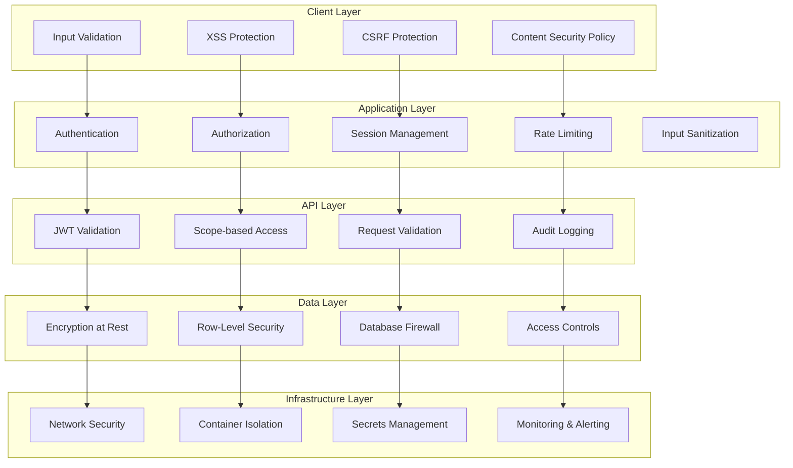

# Security Considerations

**Version:** 1.0
**Date:** August 4, 2025
**Author:** Senior Staff Software Architect, Garnizeh
**Status:** In Progress

---

## 📋 Overview

This document outlines the comprehensive security strategy for the EngLog system, covering all aspects from data protection and authentication to infrastructure security and compliance requirements. The security architecture follows defense-in-depth principles with multiple layers of protection.

## 🛡️ Security Architecture

### Defense-in-Depth Strategy



## 🔐 Data Protection

### Encryption Strategy

#### Data in Transit

```go
// TLS Configuration
type TLSConfig struct {
    MinVersion               uint16
    CipherSuites            []uint16
    PreferServerCipherSuites bool
    InsecureSkipVerify      bool
    Certificates            []tls.Certificate
}

func GetSecureTLSConfig() *tls.Config {
    return &tls.Config{
        MinVersion: tls.VersionTLS13,
        CipherSuites: []uint16{
            tls.TLS_AES_256_GCM_SHA384,
            tls.TLS_AES_128_GCM_SHA256,
            tls.TLS_CHACHA20_POLY1305_SHA256,
        },
        PreferServerCipherSuites: true,
        InsecureSkipVerify:      false,
    }
}

// HTTP Security Headers
func SecurityHeadersMiddleware() gin.HandlerFunc {
    return func(c *gin.Context) {
        // HSTS
        c.Header("Strict-Transport-Security", "max-age=63072000; includeSubDomains; preload")

        // Content Security Policy
        c.Header("Content-Security-Policy",
            "default-src 'self'; "+
            "script-src 'self' 'unsafe-inline' cdn.jsdelivr.net; "+
            "style-src 'self' 'unsafe-inline' cdn.jsdelivr.net; "+
            "img-src 'self' data: https:; "+
            "font-src 'self' cdn.jsdelivr.net; "+
            "connect-src 'self'; "+
            "frame-ancestors 'none'; "+
            "base-uri 'self'; "+
            "object-src 'none'")

        // XSS Protection
        c.Header("X-Content-Type-Options", "nosniff")
        c.Header("X-Frame-Options", "DENY")
        c.Header("X-XSS-Protection", "1; mode=block")
        c.Header("Referrer-Policy", "strict-origin-when-cross-origin")

        // Permission Policy
        c.Header("Permissions-Policy",
            "geolocation=(), microphone=(), camera=(), "+
            "fullscreen=(self), payment=()")

        c.Next()
    }
}
```

#### Data at Rest

```sql
-- Database encryption setup
-- Enable transparent data encryption
ALTER SYSTEM SET ssl = on;
ALTER SYSTEM SET ssl_cert_file = '/etc/ssl/certs/server.crt';
ALTER SYSTEM SET ssl_key_file = '/etc/ssl/private/server.key';

-- Column-level encryption for sensitive data
CREATE EXTENSION IF NOT EXISTS pgcrypto;

-- Encrypt sensitive journal content
CREATE OR REPLACE FUNCTION encrypt_journal_data(data JSONB, key TEXT)
RETURNS BYTEA AS $$
BEGIN
    RETURN pgp_sym_encrypt(data::TEXT, key);
END;
$$ LANGUAGE plpgsql SECURITY DEFINER;

CREATE OR REPLACE FUNCTION decrypt_journal_data(encrypted_data BYTEA, key TEXT)
RETURNS JSONB AS $$
BEGIN
    RETURN pgp_sym_decrypt(encrypted_data, key)::JSONB;
END;
$$ LANGUAGE plpgsql SECURITY DEFINER;

-- Encrypted journal entries table
CREATE TABLE encrypted_journal_entries (
    id UUID PRIMARY KEY DEFAULT gen_random_uuid(),
    user_id UUID NOT NULL REFERENCES users(id) ON DELETE CASCADE,
    encrypted_data BYTEA NOT NULL, -- Encrypted raw_data
    data_hash VARCHAR(64) NOT NULL, -- SHA-256 hash for integrity
    encryption_key_id VARCHAR(50) NOT NULL,
    created_at TIMESTAMP WITH TIME ZONE DEFAULT NOW(),
    updated_at TIMESTAMP WITH TIME ZONE DEFAULT NOW()
);
```

### Key Management

```go
// Key management service
type KeyManager struct {
    vault      VaultClient
    keyCache   *sync.Map
    rotationSchedule time.Duration
}

type EncryptionKey struct {
    ID        string
    Key       []byte
    Version   int
    Algorithm string
    CreatedAt time.Time
    ExpiresAt time.Time
}

func (km *KeyManager) GetEncryptionKey(keyID string) (*EncryptionKey, error) {
    // Check cache first
    if cached, ok := km.keyCache.Load(keyID); ok {
        if key, ok := cached.(*EncryptionKey); ok {
            if time.Now().Before(key.ExpiresAt) {
                return key, nil
            }
        }
    }

    // Fetch from vault
    key, err := km.vault.GetKey(keyID)
    if err != nil {
        return nil, fmt.Errorf("failed to get encryption key: %w", err)
    }

    // Cache the key
    km.keyCache.Store(keyID, key)

    return key, nil
}

func (km *KeyManager) RotateKey(keyID string) error {
    // Generate new key version
    newKey, err := km.generateNewKey(keyID)
    if err != nil {
        return err
    }

    // Store in vault
    err = km.vault.StoreKey(newKey)
    if err != nil {
        return err
    }

    // Schedule re-encryption of data with old key
    km.scheduleReEncryption(keyID, newKey.Version)

    // Invalidate cache
    km.keyCache.Delete(keyID)

    return nil
}

// Environment-specific key derivation
func DeriveDataEncryptionKey(masterKey []byte, context string) ([]byte, error) {
    // Use HKDF for key derivation
    hkdf := hkdf.New(sha256.New, masterKey, []byte("englog-salt"), []byte(context))
    key := make([]byte, 32) // 256-bit key

    _, err := io.ReadFull(hkdf, key)
    return key, err
}
```

## 🔒 Access Control

### Role-Based Access Control (RBAC)

```go
type Permission string

const (
    PermissionReadJournals    Permission = "read:journals"
    PermissionWriteJournals   Permission = "write:journals"
    PermissionDeleteJournals  Permission = "delete:journals"
    PermissionManageGroups    Permission = "manage:groups"
    PermissionInviteUsers     Permission = "invite:users"
    PermissionViewAnalytics   Permission = "view:analytics"
    PermissionExportData      Permission = "export:data"
    PermissionManageUsers     Permission = "manage:users"
    PermissionSystemAdmin     Permission = "system:admin"
)

type Role struct {
    ID          string       `json:"id"`
    Name        string       `json:"name"`
    Description string       `json:"description"`
    Permissions []Permission `json:"permissions"`
    IsSystem    bool         `json:"is_system"`
}

var SystemRoles = map[string]Role{
    "user": {
        ID:   "user",
        Name: "Standard User",
        Permissions: []Permission{
            PermissionReadJournals,
            PermissionWriteJournals,
            PermissionDeleteJournals,
            PermissionViewAnalytics,
            PermissionExportData,
        },
        IsSystem: true,
    },
    "group_admin": {
        ID:   "group_admin",
        Name: "Group Administrator",
        Permissions: []Permission{
            PermissionReadJournals,
            PermissionWriteJournals,
            PermissionDeleteJournals,
            PermissionManageGroups,
            PermissionInviteUsers,
            PermissionViewAnalytics,
            PermissionExportData,
        },
        IsSystem: true,
    },
    "system_admin": {
        ID:   "system_admin",
        Name: "System Administrator",
        Permissions: []Permission{
            PermissionReadJournals,
            PermissionWriteJournals,
            PermissionDeleteJournals,
            PermissionManageGroups,
            PermissionInviteUsers,
            PermissionViewAnalytics,
            PermissionExportData,
            PermissionManageUsers,
            PermissionSystemAdmin,
        },
        IsSystem: true,
    },
}

// Authorization middleware
func RequirePermission(permission Permission) gin.HandlerFunc {
    return func(c *gin.Context) {
        userID := c.GetString("user_id")
        if userID == "" {
            c.JSON(http.StatusUnauthorized, gin.H{"error": "Authentication required"})
            c.Abort()
            return
        }

        // Get user permissions from context or database
        userPermissions := getUserPermissions(userID)

        if !hasPermission(userPermissions, permission) {
            c.JSON(http.StatusForbidden, gin.H{
                "error": "Insufficient permissions",
                "required_permission": permission,
            })
            c.Abort()
            return
        }

        c.Next()
    }
}

func hasPermission(userPerms []Permission, required Permission) bool {
    for _, perm := range userPerms {
        if perm == required || perm == PermissionSystemAdmin {
            return true
        }
    }
    return false
}
```

### Row-Level Security (RLS)

```sql
-- Enable RLS on sensitive tables
ALTER TABLE journal_entries ENABLE ROW LEVEL SECURITY;
ALTER TABLE processed_content ENABLE ROW LEVEL SECURITY;
ALTER TABLE groups ENABLE ROW LEVEL SECURITY;
ALTER TABLE group_memberships ENABLE ROW LEVEL SECURITY;

-- Journal entries: users can only access their own entries
CREATE POLICY journal_entries_isolation ON journal_entries
FOR ALL TO application_role
USING (user_id = current_setting('app.current_user_id')::uuid);

-- Processed content: users can only access content from their journals
CREATE POLICY processed_content_isolation ON processed_content
FOR ALL TO application_role
USING (user_id = current_setting('app.current_user_id')::uuid);

-- Groups: users can only access groups they are members of
CREATE POLICY groups_member_access ON groups
FOR SELECT TO application_role
USING (
    id IN (
        SELECT group_id FROM group_memberships
        WHERE user_id = current_setting('app.current_user_id')::uuid
    ) OR owner_id = current_setting('app.current_user_id')::uuid
);

-- Groups: only owners can modify groups
CREATE POLICY groups_owner_modify ON groups
FOR UPDATE TO application_role
USING (owner_id = current_setting('app.current_user_id')::uuid);

-- Group memberships: members can view, owners/admins can modify
CREATE POLICY group_memberships_access ON group_memberships
FOR SELECT TO application_role
USING (
    user_id = current_setting('app.current_user_id')::uuid OR
    group_id IN (
        SELECT group_id FROM group_memberships
        WHERE user_id = current_setting('app.current_user_id')::uuid
        AND role IN ('owner', 'admin')
    )
);

-- Application role setup
CREATE ROLE application_role;
GRANT USAGE ON SCHEMA public TO application_role;
GRANT SELECT, INSERT, UPDATE, DELETE ON ALL TABLES IN SCHEMA public TO application_role;
GRANT USAGE ON ALL SEQUENCES IN SCHEMA public TO application_role;

-- Set user context for RLS
CREATE OR REPLACE FUNCTION set_user_context(user_id UUID)
RETURNS void AS $$
BEGIN
    PERFORM set_config('app.current_user_id', user_id::text, true);
END;
$$ LANGUAGE plpgsql SECURITY DEFINER;
```

## 🚨 Threat Prevention

### Input Validation and Sanitization

```go
// Input validation using go-playground/validator
type JournalEntryRequest struct {
    Title   *string                `json:"title" validate:"omitempty,max=200"`
    Content string                 `json:"content" validate:"required,max=50000"`
    Tags    []string              `json:"tags" validate:"dive,max=50,alphanum"`
    Metadata map[string]any `json:"metadata" validate:"dive,keys,alphanum,endkeys,required"`
}

func ValidateJournalEntry(req *JournalEntryRequest) error {
    validate := validator.New()

    // Register custom validators
    validate.RegisterValidation("safe_html", validateSafeHTML)
    validate.RegisterValidation("no_sql_injection", validateNoSQLInjection)

    if err := validate.Struct(req); err != nil {
        return fmt.Errorf("validation failed: %w", err)
    }

    // Additional content sanitization
    req.Content = sanitizeContent(req.Content)

    if req.Title != nil {
        *req.Title = sanitizeContent(*req.Title)
    }

    return nil
}

func sanitizeContent(content string) string {
    // Remove potential XSS vectors
    content = html.EscapeString(content)

    // Remove or escape potentially dangerous characters
    content = strings.ReplaceAll(content, "<script", "&lt;script")
    content = strings.ReplaceAll(content, "javascript:", "")
    content = strings.ReplaceAll(content, "vbscript:", "")

    return content
}

func validateSafeHTML(fl validator.FieldLevel) bool {
    content := fl.Field().String()

    // Check for script tags
    if strings.Contains(strings.ToLower(content), "<script") {
        return false
    }

    // Check for javascript: protocols
    if strings.Contains(strings.ToLower(content), "javascript:") {
        return false
    }

    return true
}

func validateNoSQLInjection(fl validator.FieldLevel) bool {
    content := strings.ToLower(fl.Field().String())

    // SQL injection patterns
    sqlPatterns := []string{
        "union select", "drop table", "insert into",
        "delete from", "update set", "'or'1'='1",
        "admin'--", "' or 1=1--",
    }

    for _, pattern := range sqlPatterns {
        if strings.Contains(content, pattern) {
            return false
        }
    }

    return true
}
```

### SQL Injection Prevention

```go
// Use SQLC for type-safe queries
//go:generate sqlc generate

// Example queries (queries.sql)
-- name: GetJournalsByUser :many
SELECT id, user_id, raw_data, created_at
FROM journal_entries
WHERE user_id = $1
ORDER BY created_at DESC
LIMIT $2 OFFSET $3;

-- name: CreateJournalEntry :one
INSERT INTO journal_entries (user_id, raw_data, entry_type, metadata)
VALUES ($1, $2, $3, $4)
RETURNING id, created_at;

// Generated code usage
func (s *Store) GetUserJournals(ctx context.Context, userID uuid.UUID, limit, offset int32) ([]JournalEntry, error) {
    // SQLC generates type-safe code with parameterized queries
    return s.queries.GetJournalsByUser(ctx, GetJournalsByUserParams{
        UserID: userID,
        Limit:  limit,
        Offset: offset,
    })
}

// Additional query validation
func validateQueryParams(params any) error {
    v := reflect.ValueOf(params)
    if v.Kind() == reflect.Ptr {
        v = v.Elem()
    }

    for i := 0; i < v.NumField(); i++ {
        field := v.Field(i)
        fieldType := v.Type().Field(i)

        // Validate UUID fields
        if fieldType.Type == reflect.TypeOf(uuid.UUID{}) {
            if field.Interface().(uuid.UUID) == uuid.Nil {
                return fmt.Errorf("invalid UUID in field %s", fieldType.Name)
            }
        }

        // Validate string fields for injection
        if field.Kind() == reflect.String {
            if containsSQLInjection(field.String()) {
                return fmt.Errorf("potential SQL injection in field %s", fieldType.Name)
            }
        }
    }

    return nil
}
```

### Rate Limiting and DDoS Protection

```go
// Advanced rate limiting with Redis
type AdvancedRateLimiter struct {
    redis  *redis.Client
    config RateLimitConfig
}

type RateLimitConfig struct {
    GlobalLimit    RateRule // Global requests per second
    UserLimit      RateRule // Per-user requests per minute
    IPLimit        RateRule // Per-IP requests per minute
    EndpointLimits map[string]RateRule // Per-endpoint limits
}

type RateRule struct {
    Requests int
    Window   time.Duration
    Burst    int // Allow burst requests
}

func (rl *AdvancedRateLimiter) CheckLimits(c *gin.Context) error {
    userID := c.GetString("user_id")
    ipAddress := c.ClientIP()
    endpoint := c.Request.URL.Path

    // Check global rate limit
    if !rl.checkGlobalLimit() {
        return fmt.Errorf("global rate limit exceeded")
    }

    // Check IP-based limit
    if !rl.checkIPLimit(ipAddress) {
        return fmt.Errorf("IP rate limit exceeded")
    }

    // Check user-based limit (if authenticated)
    if userID != "" && !rl.checkUserLimit(userID) {
        return fmt.Errorf("user rate limit exceeded")
    }

    // Check endpoint-specific limit
    if !rl.checkEndpointLimit(endpoint, userID, ipAddress) {
        return fmt.Errorf("endpoint rate limit exceeded")
    }

    return nil
}

func (rl *AdvancedRateLimiter) checkIPLimit(ipAddress string) bool {
    return rl.checkSlidingWindow(
        fmt.Sprintf("rate_limit:ip:%s", ipAddress),
        rl.config.IPLimit,
    )
}

func (rl *AdvancedRateLimiter) checkSlidingWindow(key string, rule RateRule) bool {
    now := time.Now()
    windowStart := now.Add(-rule.Window)

    pipe := rl.redis.Pipeline()

    // Remove expired entries
    pipe.ZRemRangeByScore(context.Background(), key,
        "0", fmt.Sprintf("%d", windowStart.UnixNano()))

    // Count current requests
    pipe.ZCard(context.Background(), key)

    // Execute pipeline
    results, err := pipe.Exec(context.Background())
    if err != nil {
        return false // Fail closed
    }

    currentCount := results[1].(*redis.IntCmd).Val()

    // Check if within limit
    if currentCount >= int64(rule.Requests) {
        return false
    }

    // Add current request
    rl.redis.ZAdd(context.Background(), key, &redis.Z{
        Score:  float64(now.UnixNano()),
        Member: fmt.Sprintf("%d", now.UnixNano()),
    })

    // Set expiration
    rl.redis.Expire(context.Background(), key, rule.Window)

    return true
}

// Rate limiting middleware
func RateLimitMiddleware(limiter *AdvancedRateLimiter) gin.HandlerFunc {
    return func(c *gin.Context) {
        if err := limiter.CheckLimits(c); err != nil {
            c.JSON(http.StatusTooManyRequests, gin.H{
                "error": "Rate limit exceeded",
                "retry_after": 60, // seconds
            })
            c.Abort()
            return
        }

        c.Next()
    }
}
```

## 🕵️ Security Monitoring

### Audit Logging

```go
type SecurityEvent struct {
    ID          string                 `json:"id"`
    Type        string                 `json:"type"`
    Severity    string                 `json:"severity"`
    UserID      string                 `json:"user_id,omitempty"`
    IPAddress   string                 `json:"ip_address"`
    UserAgent   string                 `json:"user_agent"`
    RequestID   string                 `json:"request_id"`
    Resource    string                 `json:"resource,omitempty"`
    Action      string                 `json:"action,omitempty"`
    Success     bool                   `json:"success"`
    Error       string                 `json:"error,omitempty"`
    Metadata    map[string]any `json:"metadata,omitempty"`
    Timestamp   time.Time              `json:"timestamp"`
}

type SecurityLogger struct {
    logger     *slog.Logger
    alerter    AlertManager
    repository SecurityEventRepository
}

func (sl *SecurityLogger) LogSecurityEvent(event *SecurityEvent) {
    // Set ID and timestamp if not provided
    if event.ID == "" {
        event.ID = uuid.New().String()
    }
    if event.Timestamp.IsZero() {
        event.Timestamp = time.Now()
    }

    // Log to structured logger
    sl.logger.Info("security_event",
        "event_id", event.ID,
        "event_type", event.Type,
        "severity", event.Severity,
        "user_id", event.UserID,
        "ip_address", event.IPAddress,
        "success", event.Success,
        "error", event.Error,
    )

    // Store in database for analysis
    sl.repository.Store(event)

    // Check if alert should be triggered
    if sl.shouldAlert(event) {
        sl.alerter.TriggerAlert(event)
    }
}

func (sl *SecurityLogger) shouldAlert(event *SecurityEvent) bool {
    alertConditions := map[string]bool{
        "failed_login":        event.Type == "authentication" && !event.Success,
        "privilege_escalation": event.Type == "authorization" && strings.Contains(event.Error, "insufficient permissions"),
        "suspicious_activity": event.Severity == "high",
        "multiple_failures":   sl.isRepeatedFailure(event),
    }

    for condition, shouldTrigger := range alertConditions {
        if shouldTrigger {
            return true
        }
    }

    return false
}

// Security monitoring middleware
func SecurityMonitoringMiddleware(logger *SecurityLogger) gin.HandlerFunc {
    return func(c *gin.Context) {
        start := time.Now()

        // Process request
        c.Next()

        // Log security-relevant events
        if isSecurityEvent(c) {
            event := &SecurityEvent{
                Type:      getEventType(c),
                Severity:  getSeverity(c),
                UserID:    c.GetString("user_id"),
                IPAddress: c.ClientIP(),
                UserAgent: c.GetHeader("User-Agent"),
                RequestID: c.GetString("request_id"),
                Resource:  c.Request.URL.Path,
                Action:    c.Request.Method,
                Success:   c.Writer.Status() < 400,
                Timestamp: start,
            }

            if c.Writer.Status() >= 400 {
                event.Error = getErrorFromResponse(c)
            }

            logger.LogSecurityEvent(event)
        }
    }
}
```

### Intrusion Detection

```go
type IntrusionDetector struct {
    redis      *redis.Client
    rules      []DetectionRule
    alerter    AlertManager
}

type DetectionRule struct {
    Name        string
    Pattern     string
    Threshold   int
    Window      time.Duration
    Severity    string
    Action      string // "log", "block", "alert"
}

var DefaultDetectionRules = []DetectionRule{
    {
        Name:      "Brute Force Login",
        Pattern:   "failed_login_attempts",
        Threshold: 5,
        Window:    5 * time.Minute,
        Severity:  "high",
        Action:    "block",
    },
    {
        Name:      "SQL Injection Attempt",
        Pattern:   "sql_injection_pattern",
        Threshold: 1,
        Window:    1 * time.Minute,
        Severity:  "critical",
        Action:    "alert",
    },
    {
        Name:      "Suspicious API Usage",
        Pattern:   "rapid_api_calls",
        Threshold: 100,
        Window:    1 * time.Minute,
        Severity:  "medium",
        Action:    "log",
    },
}

func (id *IntrusionDetector) AnalyzeRequest(c *gin.Context) DetectionResult {
    ipAddress := c.ClientIP()
    userID := c.GetString("user_id")

    var threats []Threat

    for _, rule := range id.rules {
        if threat := id.checkRule(rule, c, ipAddress, userID); threat != nil {
            threats = append(threats, *threat)
        }
    }

    return DetectionResult{
        Threats:   threats,
        Risk:      calculateRiskScore(threats),
        Action:    determineAction(threats),
        Timestamp: time.Now(),
    }
}

type Threat struct {
    RuleName    string
    Severity    string
    Description string
    Evidence    map[string]any
    Confidence  float64
}

type DetectionResult struct {
    Threats   []Threat
    Risk      int // 0-100
    Action    string
    Timestamp time.Time
}

func (id *IntrusionDetector) checkRule(rule DetectionRule, c *gin.Context, ipAddress, userID string) *Threat {
    switch rule.Pattern {
    case "failed_login_attempts":
        return id.checkFailedLogins(rule, ipAddress, userID)
    case "sql_injection_pattern":
        return id.checkSQLInjection(rule, c)
    case "rapid_api_calls":
        return id.checkRapidAPICalls(rule, ipAddress, userID)
    }

    return nil
}

func (id *IntrusionDetector) checkSQLInjection(rule DetectionRule, c *gin.Context) *Threat {
    suspiciousPatterns := []string{
        "union.*select", "drop.*table", "insert.*into",
        "'.*or.*'.*=.*'", "admin'--", "1=1",
    }

    // Check URL parameters
    queryString := c.Request.URL.RawQuery
    for _, pattern := range suspiciousPatterns {
        if matched, _ := regexp.MatchString(`(?i)`+pattern, queryString); matched {
            return &Threat{
                RuleName:    rule.Name,
                Severity:    rule.Severity,
                Description: "Potential SQL injection attempt detected",
                Evidence: map[string]any{
                    "pattern":      pattern,
                    "query_string": queryString,
                    "endpoint":     c.Request.URL.Path,
                },
                Confidence: 0.9,
            }
        }
    }

    // Check request body for POST requests
    if c.Request.Method == "POST" {
        body, _ := io.ReadAll(c.Request.Body)
        c.Request.Body = io.NopCloser(bytes.NewBuffer(body))

        for _, pattern := range suspiciousPatterns {
            if matched, _ := regexp.MatchString(`(?i)`+pattern, string(body)); matched {
                return &Threat{
                    RuleName:    rule.Name,
                    Severity:    rule.Severity,
                    Description: "Potential SQL injection in request body",
                    Evidence: map[string]any{
                        "pattern": pattern,
                        "body_snippet": string(body)[:min(len(body), 100)],
                    },
                    Confidence: 0.9,
                }
            }
        }
    }

    return nil
}
```

## 🔐 Secrets Management

### HashiCorp Vault Integration

```go
type VaultClient struct {
    client     *vault.Client
    authMethod string
    mountPath  string
}

func NewVaultClient(address, token string) (*VaultClient, error) {
    config := vault.DefaultConfig()
    config.Address = address

    client, err := vault.NewClient(config)
    if err != nil {
        return nil, err
    }

    client.SetToken(token)

    return &VaultClient{
        client:    client,
        mountPath: "secret/",
    }, nil
}

func (vc *VaultClient) GetSecret(path string) (map[string]any, error) {
    secret, err := vc.client.Logical().Read(vc.mountPath + path)
    if err != nil {
        return nil, err
    }

    if secret == nil {
        return nil, fmt.Errorf("secret not found: %s", path)
    }

    return secret.Data, nil
}

func (vc *VaultClient) StoreSecret(path string, data map[string]any) error {
    _, err := vc.client.Logical().Write(vc.mountPath+path, data)
    return err
}

// Environment-specific secret loading
func LoadSecretsFromVault() error {
    vault, err := NewVaultClient(
        os.Getenv("VAULT_ADDRESS"),
        os.Getenv("VAULT_TOKEN"),
    )
    if err != nil {
        return err
    }

    // Load database credentials
    dbSecrets, err := vault.GetSecret("database/credentials")
    if err != nil {
        return err
    }

    os.Setenv("DB_PASSWORD", dbSecrets["password"].(string))
    os.Setenv("DB_USERNAME", dbSecrets["username"].(string))

    // Load API keys
    apiSecrets, err := vault.GetSecret("api/keys")
    if err != nil {
        return err
    }

    os.Setenv("OPENAI_API_KEY", apiSecrets["openai"].(string))
    os.Setenv("AZURE_API_KEY", apiSecrets["azure"].(string))

    return nil
}
```

## 📋 Compliance Framework

### GDPR Compliance

```go
type GDPRManager struct {
    db          *sql.DB
    encryption  EncryptionService
    audit       AuditService
}

// Data Subject Rights Implementation
func (g *GDPRManager) HandleDataSubjectRequest(userID string, requestType string) error {
    switch requestType {
    case "access":
        return g.exportUserData(userID)
    case "rectification":
        return g.enableDataCorrection(userID)
    case "erasure":
        return g.deleteUserData(userID)
    case "portability":
        return g.exportPortableData(userID)
    case "restriction":
        return g.restrictProcessing(userID)
    case "objection":
        return g.stopProcessing(userID)
    default:
        return fmt.Errorf("unknown request type: %s", requestType)
    }
}

func (g *GDPRManager) exportUserData(userID string) error {
    // Collect all user data
    userData := &UserDataExport{
        PersonalInfo: g.getPersonalInfo(userID),
        Journals:     g.getJournalEntries(userID),
        ProcessedData: g.getProcessedContent(userID),
        Groups:       g.getGroupMemberships(userID),
        Preferences:  g.getUserPreferences(userID),
        AuditLog:     g.getAuditTrail(userID),
    }

    // Encrypt export
    encryptedData, err := g.encryption.Encrypt(userData)
    if err != nil {
        return err
    }

    // Store temporarily for download
    exportID := uuid.New().String()
    err = g.storeExport(exportID, encryptedData, userID)
    if err != nil {
        return err
    }

    // Log GDPR request
    g.audit.LogGDPRRequest(userID, "data_export", exportID)

    return nil
}

func (g *GDPRManager) deleteUserData(userID string) error {
    tx, err := g.db.Begin()
    if err != nil {
        return err
    }
    defer tx.Rollback()

    // Delete in correct order to respect foreign key constraints
    deletions := []string{
        "DELETE FROM processed_content WHERE user_id = $1",
        "DELETE FROM group_assignments WHERE journal_id IN (SELECT id FROM journal_entries WHERE user_id = $1)",
        "DELETE FROM journal_entries WHERE user_id = $1",
        "DELETE FROM group_memberships WHERE user_id = $1",
        "DELETE FROM context_store WHERE user_id = $1",
        "DELETE FROM sessions WHERE user_id = $1",
        "UPDATE users SET email = 'deleted_' || id || '@deleted.com', name = 'Deleted User' WHERE id = $1",
    }

    for _, query := range deletions {
        _, err := tx.Exec(query, userID)
        if err != nil {
            return err
        }
    }

    err = tx.Commit()
    if err != nil {
        return err
    }

    // Log GDPR deletion
    g.audit.LogGDPRRequest(userID, "data_deletion", "")

    return nil
}

// Data retention policy
func (g *GDPRManager) ApplyRetentionPolicy() error {
    // Delete old audit logs (keep 7 years for compliance)
    cutoffDate := time.Now().AddDate(-7, 0, 0)

    _, err := g.db.Exec(`
        DELETE FROM audit_log
        WHERE changed_at < $1
        AND table_name NOT IN ('users', 'critical_operations')
    `, cutoffDate)

    if err != nil {
        return err
    }

    // Archive old journal entries (user configurable, default 5 years)
    archiveCutoff := time.Now().AddDate(-5, 0, 0)

    _, err = g.db.Exec(`
        UPDATE journal_entries
        SET archived = true
        WHERE created_at < $1
        AND user_id IN (
            SELECT id FROM users
            WHERE preferences->>'data_retention_years' IS NULL
            OR (preferences->>'data_retention_years')::int <= 5
        )
    `, archiveCutoff)

    return err
}
```

---

## 🔗 Related Documents

- **[Authentication Design](./AUTHENTICATION.md)** - Authentication security measures
- **[API Service Design](../components/API_SERVICE.md)** - API security implementation
- **[Database Design](../components/DATABASE.md)** - Database security and RLS
- **[Deployment](./DEPLOYMENT.md)** - Infrastructure security
- **[Monitoring](./MONITORING.md)** - Security monitoring and alerting

---

**Document Status:** 🚧 In Progress
**Next Review:** 2025-09-04
**Last Updated:** 2025-08-04

---

_This document outlines the comprehensive security strategy for the EngLog system. It serves as the technical specification for implementing defense-in-depth security measures across all system components._
