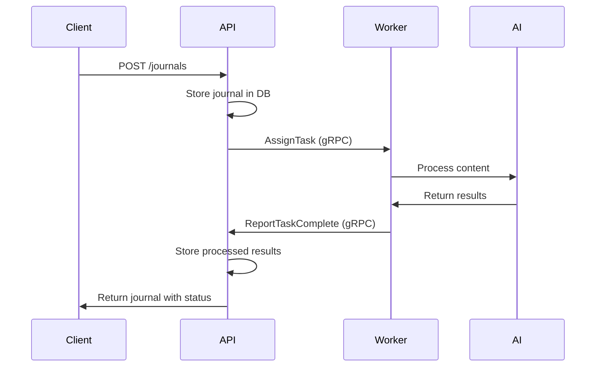

# MVP-002: Microservices Architecture Setup

**Feature:** MVP-INFRA
**Priority:** P0 (Critical)
**Effort:** Large (3 days)
**Dependencies:** None

## Objective

Evolve from Phase 0 monolith to microservices architecture with API Service and Worker Pool, establishing the foundation for distributed processing and horizontal scaling.

## Technical Scope

### Architecture Evolution

- Separate API Service from Worker Pool services
- Implement gRPC communication between services
- Set up service discovery and coordination
- Establish inter-service communication patterns

### Service Structure

```
englog/
├── cmd/
│   ├── api/          # API Service entrypoint
│   ├── worker/       # Worker Service entrypoint
│   └── migrate/      # Database migration tool
├── internal/
│   ├── api/          # API service logic
│   ├── worker/       # Worker service logic
│   ├── shared/       # Shared libraries
│   └── proto/        # gRPC protobuf definitions
└── docker-compose.yml
```

### gRPC Communication

- Protocol Buffer definitions for service contracts
- Task assignment and status reporting
- Worker registration and heartbeat
- Error handling and retry mechanisms

## Acceptance Criteria

### Functional Requirements

- [ ] API Service and Worker Service can run independently
- [ ] gRPC communication established between services
- [ ] Worker registration and task assignment working
- [ ] Services can be scaled independently via Docker Compose
- [ ] Health checks implemented for both services

### Technical Requirements

- [ ] Clean separation of concerns between services
- [ ] Proper error handling and logging across services
- [ ] Configuration management for multi-service setup
- [ ] Development environment supports both services
- [ ] Inter-service communication secured and monitored

### Architecture Requirements

- [ ] API Service handles HTTP requests and user management
- [ ] Worker Service focuses only on AI processing tasks
- [ ] gRPC server/client implementation working correctly
- [ ] Service discovery mechanism implemented
- [ ] Graceful shutdown and startup procedures

## Implementation Details

### gRPC Protocol Definitions

```protobuf
syntax = "proto3";

package englog.worker.v1;

service WorkerCoordinator {
  rpc RegisterWorker(WorkerRegistration) returns (RegistrationResponse);
  rpc GetTask(TaskRequest) returns (TaskAssignment);
  rpc ReportTaskComplete(TaskCompletion) returns (TaskResponse);
  rpc Heartbeat(HeartbeatRequest) returns (HeartbeatResponse);
}

message TaskAssignment {
  string task_id = 1;
  string task_type = 2;
  string journal_id = 3;
  string user_id = 4;
  string content = 5;
  map<string, string> metadata = 6;
}

message TaskCompletion {
  string task_id = 1;
  bool success = 2;
  string result_data = 3;
  string error_message = 4;
}
```

### API Service Structure

```go
// cmd/api/main.go
type APIServer struct {
    httpServer   *http.Server
    grpcServer   *grpc.Server
    workerClient WorkerCoordinatorClient
    db          *sql.DB
}

// API handles HTTP requests
// gRPC server coordinates with workers
```

### Worker Service Structure

```go
// cmd/worker/main.go
type WorkerService struct {
    apiClient    WorkerCoordinatorClient
    aiService    AIProcessor
    workerID     string
    capabilities []string
}

// Worker registers with API service
// Processes assigned tasks
// Reports results back
```

### Service Communication Flow



## Testing Strategy

### Unit Tests

- gRPC client/server communication
- Service initialization and shutdown
- Error handling in inter-service calls
- Configuration validation

### Integration Tests

- End-to-end task processing flow
- Service discovery and registration
- Multi-service Docker Compose startup
- Database access from both services

### Performance Tests

- gRPC communication latency
- Service startup time
- Resource usage per service
- Concurrent task processing

## Configuration Management

### Environment Variables

```env
# API Service
API_PORT=8080
GRPC_PORT=50051
DB_URL=postgres://...
WORKER_TIMEOUT=30s

# Worker Service
API_GRPC_ADDRESS=api:50051
WORKER_ID=worker-001
AI_PROVIDER=ollama
OLLAMA_URL=http://ollama:11434
```

### Docker Compose Setup

```yaml
version: "3.8"
services:
  api:
    build:
      context: .
      dockerfile: Dockerfile.api
    ports:
      - "8080:8080"
      - "50051:50051"
    environment:
      - DB_URL=postgres://postgres:password@db:5432/englog
    depends_on:
      - db

  worker:
    build:
      context: .
      dockerfile: Dockerfile.worker
    environment:
      - API_GRPC_ADDRESS=api:50051
      - OLLAMA_URL=http://ollama:11434
    depends_on:
      - api
      - ollama
    scale: 2 # Multiple workers

  db:
    image: postgres:15-alpine
    # ... database config

  ollama:
    image: ollama/ollama
    # ... Ollama config
```

## Migration Strategy from Phase 0

### Code Reorganization

1. **Extract Worker Logic:** Move AI processing from handlers to worker service
2. **Separate Concerns:** API handles HTTP, Worker handles processing
3. **Add gRPC Layer:** Implement communication protocol
4. **Update Configuration:** Environment-based service configuration

### Backwards Compatibility

- Maintain existing HTTP API endpoints
- Ensure journal creation flow still works
- Keep processing results format consistent
- Preserve logging and monitoring

## Development Workflow

### Local Development

```bash
# Start all services
docker-compose up -d

# Scale workers
docker-compose up --scale worker=3

# View logs
docker-compose logs -f api
docker-compose logs -f worker
```

### Service Management

- Individual service builds and deployment
- Independent scaling capabilities
- Service health monitoring
- Centralized logging aggregation

## Dependencies

### External Dependencies

- gRPC Go libraries
- Protocol Buffer compiler
- Docker and Docker Compose
- Service discovery mechanism

### Internal Dependencies

- Database setup (MVP-001)
- Logging framework
- Configuration management
- Error handling patterns

## Deliverables

1. **Service Architecture:** Separated API and Worker services
2. **gRPC Communication:** Working inter-service communication
3. **Docker Setup:** Multi-service Docker Compose configuration
4. **Proto Definitions:** gRPC service contracts
5. **Documentation:** Architecture and setup documentation

## Definition of Done

- [ ] API Service and Worker Service running independently
- [ ] gRPC communication working between services
- [ ] Docker Compose setup with multi-service support
- [ ] Worker registration and task assignment functional
- [ ] Health checks implemented for service monitoring
- [ ] Unit and integration tests passing
- [ ] Documentation updated with new architecture
- [ ] Code review completed and approved

---

**Estimated Timeline:** 3 days
**Risk Level:** Medium (complexity of service separation)
**Blockers:** None
**Follow-up Tasks:** MVP-009 (gRPC Worker Pool), MVP-022 (Docker Production Setup)
